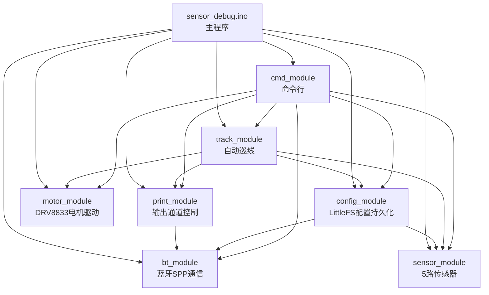

# 系统设计文档

记录硬件/软件设计决策、变更原因和风险评估，以及硬件/命令速查参考。按主题分节，持续更新。
（2026-07-22起本项目文档统一维护在这一份文件里，不再使用README.txt）

---

## 硬件参考

### 硬件平台
- 主控：ESP32（Arduino IDE开发）
- 传感器：AE-NJL5901AR-8CH（8路红外反射传感器），传感器间距16mm
- 电机驱动：DRV8833
- 比赛线宽：19mm（白线）

### 引脚定义（PCB固定，不可修改）

传感器（AE-NJL5901AR-8CH）：

| 通道 | 引脚 | ADC | 蓝牙开启时可用 | 使用 |
|---|---|---|---|---|
| CH1 | D32 | ADC1 | 可用 | 未用 |
| CH2 | D33 | ADC1 | 可用 | ← 使用 |
| CH3 | D34 | ADC1 | 可用 | ← 使用 |
| CH4 | D35 | ADC1 | 可用 | ← 使用 |
| CH5 | VP(GPIO36) | ADC1 | 可用 | ← 使用 |
| CH6 | VN(GPIO39) | ADC1 | 可用 | ← 使用 |
| CH7 | D13 | ADC2 | **不可用** | 未用 |
| CH8 | D14 | ADC2 | **不可用** | 未用 |

注：CH7/CH8是ADC2，蓝牙开启时读值会出错，禁用不用。

电机驱动（DRV8833）：
- GPIO17 → EEP 使能（HIGH=工作，LOW=睡眠）
- GPIO18 → IN1 右电机 / GPIO19 → IN2 右电机
- GPIO21 → IN3 左电机 / GPIO22 → IN4 左电机

其他：
- GPIO2 → 板载LED（BT已连接=常亮，未连接=常灭，不闪烁——sensor_debug.ino里是
  `digitalWrite`直接跟随`bt_connected()`；另有BT连接诊断log，见下方"代码结构与命令参考"）
- GPIO0 → Boot按钮（按一下切换track on/off，物理开关）

### 传感器说明
- 使用中间5路：CH2~CH6，跨度4×16=64mm，左右对称
- 输出特性：白色=低值，黑色=高值（NPN光电晶体管active-low）
- 实测阈值（各路独立，代码内默认值，可被`/config.json`覆盖）：

| 通道 | 实测白 | 实测黑 | 代码默认阈值 | 备注 |
|---|---|---|---|---|
| CH2(D33) | ~660 | ~2400 | 1545 | 已实测校准，`/config.json`中为1530 |
| CH3(D34) | ~660 | ~2500 | 1580 | |
| CH4(D35) | ~545 | ~2300 | 1422 | |
| CH5(VP36) | ~600 | ~2200 | 1400 | |
| CH6(VN39) | ~600 | ~2400 | 1115 | 已实测校准，`/config.json`中为1500 |

注：CH2/CH6代码内默认值尚未同步更新，实际跑的是`/config.json`里save过的1530/1500；
如需换新设备/清空flash，记得先跑一遍`threshold`+`save`，或手动同步`sensor_module.cpp`默认值。

### 电源
双18650方案：
- 电池1 → 升压5V → ESP32 + 传感器
- 电池2 → DRV8833 → 电机（后升压到7V，见下方"电机供电改造：升压至7V"节的决策记录）

注意：上电瞬间电压抖动，代码中关闭欠压检测器：`WRITE_PERI_REG(RTC_CNTL_BROWN_OUT_REG, 0);`

---

## 代码结构与命令参考

### 目录结构
```
sensor_debug/
├── sensor_debug.ino     主程序入口
├── bt_module.h/cpp      蓝牙模块
├── print_module.h/cpp   输出控制模块（USB/BT/Flash文件三通道）
├── sensor_module.h/cpp  传感器模块
├── motor_module.h/cpp   电机模块
├── config_module.h/cpp  配置持久化模块（LittleFS+JSON）
├── track_module.h/cpp   自动巡线模块（bangbang/pid双算法，运行时可切换）
└── cmd_module.h/cpp     命令行模块
```
各模块职责、接口、依赖关系详见下方"软件模块设计"节。

### BT/USB命令列表

| 命令 | 说明 |
|---|---|
| `print on/off` | USB+BT 数据流同时开关 |
| `print usb on/off` | 仅控制USB数据流 |
| `print bt on/off` | 仅控制BT数据流 |
| `print file on/off` | 仅控制文件数据流（写入`/track.log`），BT不稳定时开这个留档，仅内存生效，需`save`才写入Flash |
| `go N` | 前进N秒（1~60），使用当前速度 |
| `back N` | 后退N秒（1~60），使用当前速度 |
| `spin left/right N` | 原地旋转N秒（1~60），测试最小转弯半径用 |
| `stop` | 立即停止电机（同时会退出巡线模式） |
| `track on/off` | 开启/关闭自动巡线 |
| `speed N` | 设置速度档位（1~40，默认12），仅内存生效，需`save`才写入Flash |
| `turnspeed N` | 设置急弯外轮速度比例（0~100%，默认65），仅内存生效，需`save`才写入Flash |
| `sharpratio N` | 设置急弯内轮反转比例（0~100%，默认30），仅内存生效，需`save`才写入Flash |
| `algo bangbang/pid` | 切换巡线算法（默认bangbang），仅内存生效，需`save`才写入Flash |
| `pid kp/ki/kd N` | 设置PID三个增益（浮点数，默认Kp=40.0/Ki=0.0/Kd=5.0），仅内存生效，需`save`才写入Flash |
| `save` | 把当前所有可调参数（速度/急弯外轮比例/急弯内轮反转比例/算法/PID三个增益/文件log开关/5路阈值）保存到`/config.json` |
| `config` | 打印当前配置的JSON内容 |
| `log dump` | 把`/track.log`整份内容打印到Serial（USB），dump前自动flush缓冲区 |
| `log clear` | 删除`/track.log` |
| `log status` | 查看文件log是否开启、当前大小 |
| `threshold CH VALUE` | 设置CHx(2~6)的阈值，仅内存生效，需`save`才写入Flash |
| `help` | 显示命令帮助 |

注：开机自动从`/config.json`加载所有可调参数；文件不存在或无该字段时用默认值。
注：速度档位2026-07-08起从1~10改为1~40（分辨率×4，原N档=新N×4档），旧`/config.json`里
保存的speed字段是旧档位数值，升级后含义已变，需要重新用`speed`命令设置并`save`。

### 依赖库（Arduino Library Manager安装）
- ArduinoJson（Benoit Blanchon，v6）← config_module使用
- LittleFS 和 BluetoothSerial 为ESP32核心自带，无需安装

---

## 待完成清单

- 传感器离地高度变了，CH2~CH6阈值可考虑重新校准（`print on`实测白/黑ADC值→
  `threshold CH VALUE`→`save`），非必须——R70已经稳定通过，这一项优先级较低，
  除非后续遇到新问题
- 公司比赛赛道还没实测过，目前所有结论（R70、sharpratio调参等）只在自建赛道上成立
- PID模式（`algo pid`）刚加上，Kp/Ki/Kd默认值未经实车验证，需要现场试调后再评估是否比
  bangbang更平稳（Kd项对传感器噪声敏感，如果车身抖动明显优先怀疑Kd偏大）
- BT经常连不上的问题还没查出根因，已加BT connected/ERROR诊断log和`print file on`/
  `log dump`这套Flash留档机制先顶上，但根本原因待排查
- `print file on`刚加上，还没实测验证过BT断连期间文件log能否完整记录
- **已确认过一个bug并修复（2026-07-22）：** `log dump`在文件较大（log-3.txt实测约
  193KB）时会触发ESP32任务看门狗复位——`print_file_dump()`用`while`循环连续
  `Serial.write()`，193KB在115200波特率下要传输约17秒，中途没有`yield()`会喂不到
  看门狗。已在循环里加`yield()`修复，但还没重新烧录实测验证过修复是否彻底解决
  （比如超大文件在17秒的Serial阻塞期间`cmd_poll()`/`track_update()`会不会跑不到，
  需要注意`log dump`期间车辆最好是静止/track off状态，不要指望这期间还能正常巡线）

---

## R70急弯：外轮同步降速

**日期：** 2026-07-19

**背景：** 机械改造（传感器挪到轮轴50mm处）后实测：车速稍快，急弯直接冲出赛道；车速调到更慢，电机因静摩擦死区直接不走了——"能动"和"能过弯"这两个速度区间几乎没有重叠（详细分析见下方"软件模块设计"里track_module的问题记录）。

**根因：** 原来的急转逻辑（`SHARP_L`/`SHARP_R`）只反转内轮，外轮仍是和直行一样的`base`满速，车身带着直道的动能冲进急弯，转向力矩来不及在冲出赛道前把车头掰过来。

**改动：** 给急弯新增一个独立的"外轮速度比例"参数`_turn_outer_ratio`（track_module.cpp），触发`SHARP_L`/`SHARP_R`时外轮也降到`base * ratio`而不是维持满速，默认65%，运行时可调（不用重新烧录）：
- 新增BT/USB命令 `turnspeed N`（N=0~100，百分比），对应`track_set_turn_ratio()`
- 纳入`config_module`持久化（JSON新增`turn_ratio`字段），`save`命令一并保存，开机自动加载
- `speed`档位继续控制直道基准速度（解决"死区"问题的那个量），`turnspeed`只影响急弯瞬间的外轮（解决"过弯冲出去"的那个量），两者解耦，不用再用同一个全局速度硬扛两个矛盾的约束

**待办：**
- 实车测试`turnspeed`从65%开始调，观察R70能否通过、是否还会冲出去
- 若外轮降速仍不够，可能还需要"丢线冲出后自动倒车找线"这个后续方案（已讨论，未实现）

---

## 参数调优记录：sharpratio -30%→-40%

**日期：** 2026-07-22

**背景：** `log分析/log-2.txt`（自建赛道，46.6秒连续巡线，详见`log分析/log-2-分析报告.txt`）
分析发现两次丢线时长逼近`LOST_TIMEOUT_MS`(1500ms)上限的情况，均为`SHARP_R→LOST_R`
（右转弯后长时间找不到线）：T1107117~1108497约1380ms（余量120ms）、
T1122087~1123407约1320ms（余量180ms）。虽然两次都在超时前重新压回线上没有真正
触发`LOST_STOP`，但余量偏薄，属于隐患而非已确认的失败。

为此新增了`sharpratio`命令（对应`_sharp_ratio`，原来是硬编码`TURN_RATIO_SHARP`
常量，现在跟`turnspeed`一样运行时可调+持久化，见"软件模块设计"里track_module的
相关记录），目的是加大急弯内轮反转力度，让车头更快甩过弯，缩短丢线时长。

**改动（本轮只改了一个参数）：**

调整前（log-2.txt实测时的参数，`sharp_ratio`为代码默认值-0.3，未曾调过）：
```json
{"speed":16,"turn_ratio":0.65,"sharp_ratio":-0.3,"threshold":[1546,1580,1422,1400,1500]}
```

调整后（实车执行`sharpratio 40` + `save`）：
```json
{"speed":16,"turn_ratio":0.65,"sharp_ratio":-0.4,"threshold":[1546,1580,1422,1400,1500]}
```

只有`sharp_ratio`从-0.3变成-0.4（急弯内轮反转力度从30%加大到40%），
`speed`/`turn_ratio`/5路阈值均未变。

**效果：** 用户实车（仍是自建赛道）测试反馈"效果还可以"——这是定性判断，
目前没有配套的新log文件做量化对比，无法确认之前那两处逼近超时的LOST_R具体
缩短了多少。

**待办：**
- 如需量化验证，按跟log-2同样的方式（`print bt on` + `track on`）跑一遍并导出
  日志（存成`log分析/log-3.txt`），可以直接对比同样两个弯（右转SHARP_R→LOST_R）
  这次丢线时长是否比log-2的1320~1380ms明显缩短，以及有没有引入新问题
  （比如内轮反转力度加大后是否出现打滑、左转是否受影响）
- 仍未在公司比赛赛道实测，这轮调参的结论只在自建赛道上成立

---

## 新增PID算法，与bangbang并列可切换

**日期：** 2026-07-22

**背景：** track_module原本只有一种算法——基于5路离散白/黑状态、按优先级判定的三级
差速bang-bang控制（详见"软件模块设计"里track_module的算法确认与流程图）。用户要求
增加一个PID算法作为可选项，默认仍是bangbang，可通过参数切换，方便对比哪种更平稳。

**设计取舍：**

1. **误差从哪来**：`sensor_module.cpp`本来就有一个连续加权位置`sensor_position()`
   （-1.0~+1.0），但之前只用于`print on`的调试打印，`track_update()`控制路径完全
   没用到它。PID正好需要这个连续误差量，直接复用。
2. **避免重复采样**：`sensor_position()`内部会自己调一次`sensor_binary()`重新读
   ADC，如果PID模式直接调它，就会在`track_update()`一个loop周期里对5路传感器采样
   两次（开头`sensor_binary(is_white)`一次，PID分支`sensor_position()`又一次），
   跟log-1分析报告里发现的"打印代码多次独立采样导致log自相矛盾"是同一类问题，还会
   拖慢控制周期。为此把`sensor_position()`拆成了一个纯函数`sensor_position_from
   (is_white[])`，PID分支直接传入`track_update()`开头已经读好的那份`is_white[]`，
   只采样一次。
3. **算法切换点**：`lost`（丢线）和`cross`（十字路口/宽线）两个判定继续用原来的
   离散布尔状态、两种算法共用，不区分bangbang/pid——这两个是"异常状态处理"，没有
   必要为PID单独做一套，丢线时依然延续`_last_dir`方向反转找线（沿用bang-bang的
   `sharp_turn`），超时1.5s停车逻辑也不变。只有"五路里有白线、不丢线也不是十字
   路口"这个正常跟踪分支，才按`_algo`分岔成bangbang优先级判定 或 PID闭环两条路。
4. **PID输出直接是PWM差速修正量**，不做归一化：`output = Kp*error + Ki*积分 +
   Kd*微分`，`pwm_l = base + output`、`pwm_r = base - output`（error>0=线偏右
   →左轮加速/右轮减速），最后clamp到±255防止溢出。这样Kp的量纲直接是"每单位误差
   对应多少PWM"，跟bang-bang里`sharp_turn`/`mild_turn`的PWM直觉一致，方便调参时
   类比（比如error=1时Kp*1应该跟`sharp_turn`的量级差不多）。
5. **积分限幅+状态重置**：积分项限幅±2.0防止长时间小误差累积失控（抗积分饱和）；
   `track_set(on)`开关巡线、`track_set_algo()`切换算法、进入`lost`状态时都会清空
   PID的积分/微分历史，避免带着丢线期间或上一次运行的陈旧误差数据继续算，冲一把。

**参数（均运行时可调，纳入config_module持久化）：**
- `algo bangbang` / `algo pid`：切换算法，默认bangbang
- `pid kp N` / `pid ki N` / `pid kd N`：浮点数，默认Kp=40.0 / Ki=0.0 / Kd=5.0

**风险与待办：**
- 三个PID默认增益（Kp40/Ki0/Kd5）和积分限幅(±2.0)都只是起调参考值，**完全没有
  实车验证过**，跟当年`TURN_RATIO_SHARP`/`TURN_OUTER_RATIO_DEFAULT`第一次给默认值
  时一样，需要实车从这个起点开始试调，不能直接当作可用参数
- 还没和bangbang在同一条赛道上做过对比测试，不知道PID实际是否比bang-bang更平稳，
  这正是用户想通过新增这个算法来验证的问题，待实测
- Kd项对传感器噪声敏感（丢线边缘、阈值抖动都会在error上产生突变，微分会放大），
  如果实车测试发现车身抖动明显，优先怀疑Kd偏大

---

## Flash文件log（/track.log），应对BT连接不稳定

**日期：** 2026-07-22

**背景：** 用户反馈更新固件后BT有时候连不上（具体原因还在排查，见sensor_debug.ino新增的
BT连接诊断log）。BT本身不稳定意味着靠BT实时看log这条路不可靠，需要一个不依赖BT连接的
留档方式：track_module的调试log先写到ESP32的Flash上，等USB接上（不受BT状态影响）再
整份取出来看。

**设计取舍：**

1. **挂在`print_module`已有的输出分发点上**，不改`track_module`一行代码。`print_module`
   本来就是`out()`统一分发到USB/BT两个通道的地方，直接加第三个通道`_file`即可，
   `track_module`调试log已经在走`out()`，天然就会同时落盘，不需要在track_module里
   额外调用什么。
2. **不能每条log都直接写flash**：`track_update()`的调试log默认30ms节流一次，如果
   `out_file()`直接同步调`LittleFS`写文件，flash写入延迟（几ms到十几ms不等）会拖慢
   `track_update()`本身，等于往巡线控制的实时性里注入抖动——考虑到log-2分析已经发现
   过丢线时长逼近1500ms超时上限这种"余量本来就薄"的情况，控制循环变慢是绝对要避免的。
   所以`out_file()`先把内容写进一个1024字节的内存缓冲区`_file_buf`，攒满了才真正调
   一次`LittleFS.open(...,"a")`写入并关闭文件，把flash写入频率从"每30ms一次"降到大约
   "每写满1KB一次"（实测每条log行约30~40字节，大概25~30条log才会触发一次真正的flash
   写入，也就是不到1秒一次，跟原本200ms节流的传感器打印处于同一量级，可接受）。
3. **文件大小上限256KB**（`LOG_FILE_MAX_BYTES`）：防止忘记`log clear`导致这个文件一直
   涨、把LittleFS分区写满进而影响`/config.json`的正常读写（config_module依赖同一个
   分区）。写入总量+缓冲区超过上限后停止追加，只打印一次`ERROR: log file full`提示
   （避免每次写入都重复刷屏），需要手动`log clear`才会继续记录。
4. **落盘字节数用内存计数`_file_total_bytes`缓存**，不是每次`out_file()`调用都去查
   文件系统大小——查询本身也要碰flash/文件系统元数据，高频调用同样会拖慢控制循环。
   只在`file_flush()`真正写入后更新这个计数，以及`print_set_file(true)`第一次开启时
   同步一次已有文件的大小（用于跨掉电/重启场景下不会把上限判断算错）。
5. **`print_begin()`不能碰LittleFS**：`setup()`里`print_begin()`排在`config_begin()`
   （挂载LittleFS的地方）之前调用，这时候文件系统还没mount，如果在`print_begin()`里
   查文件大小会读到一个尚未初始化的文件系统状态。所以文件大小同步延后到`print_set_file
   (true)`第一次被调用时才做，那时候一定已经过了`config_begin()`。

**新增命令：**
- `print file on` / `print file off`：开关文件通道（跟`print usb`/`print bt`并列，
  互不影响，可以只开文件通道而不开BT/USB）
- `log dump`：把`/track.log`整份内容打印到Serial（USB），dump前会先把内存缓冲区里
  还没落盘的部分强制flush一次，保证看到的是最新数据
- `log clear`：删除`/track.log`，重置计数和"文件已满"的警告状态
- `log status`：查看当前是否在记录、文件当前大小

**2026-07-22补充：`print file on/off`纳入config_module持久化。** 最初这个开关跟
`_usb`/`_bt`一样每次开机都重置为false，用户反馈需要重新开机后自动保持上次的开关状态，
于是仿照`turn_ratio`/`algo`那套模式加了`/config.json`的`file_log`字段，`config_begin()`
里在解析完PID三个增益后调`print_set_file(doc["file_log"] | print_file_enabled())`
恢复状态，`config_save()`/`config_print()`一并读写。注意这个恢复调用必须放在
`config_begin()`里`LittleFS.begin(true)`已经执行之后（本来就是，因为要先读到`doc`
才能取`file_log`字段），不会有print_module那边"LittleFS还没mount"的问题。

**风险与待办：**
- 上电异常掉电场景下，`_file_buf`里还没攒够1KB、还没落盘的那部分数据会丢失——这是
  故意的取舍（用内存缓冲区换取减少flash写入频率），不是bug；如果测试完想保留完整log，
  建议先`print file off`（会强制flush剩余缓冲区）或者直接`log dump`，再断电
- 256KB上限和1024字节缓冲区大小都是保守的起始值，没有针对ESP32实际LittleFS分区大小
  做过校验，如果发现分区本身比较小、256KB就已经占比很高，需要相应调低
- 还没实测验证：①BT断连期间文件log确实能完整记录track_module的调试log；
  ②`log dump`在USB串口监视器里能否完整、不乱码地把log倒出来（尤其文件比较大时）

---

## 电机供电改造：升压至7V

**日期：** 2026-07-19

**改动：** 电机侧供电由单18650（3.7V）经升压模块稳压升到7V，直接给DRV8833 VM供电，目的是让电机性能变强。

**硬件参数：**

供电：单18650 → 升压模块 → 稳定7V → DRV8833 VM

电机：Tamiya 70168 双电机减速齿轮箱套件，电机型号为马夫奇FA-130
- 额定电压：1.5~3V（说明书标称工作电压3V，原装用2节AA电池）
- 空载电流：约0.15A（3V时）
- 堵转电流：约2.1A（3V时）

驱动：DRV8833
- VM工作电压范围：2.7~10.8V（TI规格书）
- 单通道额定电流：1.5A（连续）/ 2A（峰值，需良好散热铜皮才能达到）

**风险评估：**

7V约为电机额定电压的2.3倍，DRV8833本身电气上没问题（7V在2.7~10.8V安全区间内），但对电机是明显超压，有两个风险：

1. 电机寿命/发热：转速远超设计值，电刷/换向器磨损加快，绕组发热明显增加，长期连续跑容易烧线圈或电刷积碳打火。不会立刻炸，但寿命会大幅缩短。

2. 堵转电流可能超过DRV8833额定（更值得关注）：堵转电流大致正比于电压，3V时~2.1A，粗略换算到7V可能到4~5A，超过DRV8833单通道1.5A（连续）/2A（峰值）的额定值。track_module.cpp里急弯（SHARP_L/SHARP_R）会让内轮反转到-30%，这个瞬间是类堵转/急反转工况，正是电流冲击最大的时刻，也是最容易让DRV8833过流保护跳闸或过热损坏的场景。

**建议/待办：**
- 实测急转弯瞬间的电流（或卡住电机测堵转电流），确认是否接近或超过DRV8833的1.5~2A
- 如果PCB上DRV8833周围没有足够散热铜皮，2A峰值也未必扛得住，容易热保护自动断
- 折中方案：软件上把`motor_level_to_pwm`（motor_module.cpp）的PWM上限压低（比如封顶到180左右而不是255），相当于把最大有效电压限制在~5V左右，比原3V方案更有劲，又不会像满7V那样激进
- 电机摸起来烫手是过热信号，是电机寿命在倒计时的直接证据

**状态：** 已改造为7V供电，尚未实测电流，尚未加软件PWM上限保护。

---

## 软件模块设计

代码位于 `sensor_debug/`，Arduino项目，主程序 `sensor_debug.ino` + 7个功能模块（每个模块一对 `.h`/`.cpp`）。模块间以C函数接口通信，无全局状态共享（各模块内部用`static`变量封装私有状态）。

### 模块依赖关系



依赖是单向的，没有循环依赖。`sensor_module`/`motor_module`/`bt_module`是最底层，不依赖任何其他自定义模块；`print_module`只依赖`bt_module`（把BT作为一个输出通道）；`config_module`/`track_module`依赖底层模块做实际读写；`cmd_module`是最上层，几乎依赖所有模块，因为命令行要能操控整个系统。

### 各模块职责

**bt_module** — 蓝牙SPP通信封装
- 接口：`bt_begin(name)` / `bt_connected()` / `bt_send(msg)` / `bt_poll_line(buf, maxlen)`
- 内部维护一个64字节行缓冲区`_line_buf`，`bt_poll_line`做字符级读取，处理退格（0x08/0x7F）和回车换行，实现带回显的行读取，收到完整行返回true
- 是`print_module`和`cmd_module`共同依赖的底层通道

**print_module** — 数据流输出开关（区别于命令响应）
- 接口：`print_begin()` / `print_set_usb(bool)` / `print_set_bt(bool)` / `print_set_file(bool)` / `out(msg)` / `out_usb(msg)` / `out_bt(msg)` / `out_file(msg)` / `print_file_dump()` / `print_file_clear()` / `print_file_size()` / `print_file_flush()`
- 内部三个bool开关`_usb`/`_bt`/`_file`，默认都是false（开机不输出）；`_usb`/`_bt`每次开机都重置为false需手动`print on`开启，`_file`则会被`config_module`从`/config.json`的`file_log`字段恢复成上次`save`时的状态（2026-07-22加上，之前`_file`跟`_usb`/`_bt`一样每次都要手动开）
- 用途：给高频/大量的调试数据流（传感器读数、track调试log）加开关，避免刷屏；命令响应走`cmd_module`自己的`reply()`，不经过这里，所以命令始终可见
- 第三个通道`_file`把同一份数据流写入`/track.log`（LittleFS），给BT不稳定/断连场景用：track_module的调试log正常走`out()`时会同时落盘，事后USB接上用`log dump`命令整份打印出来。为了不拖慢`track_update()`的实时性，写入先进`_file_buf`（1024字节）内存缓冲区攒着，攒满才真正写flash一次，不是每条log都直接写文件；文件大小上限256KB（`LOG_FILE_MAX_BYTES`），超过后停止写入并打印一次性的`ERROR: log file full`提示，需要`log clear`手动清空才能继续记录
- 注意`print_begin()`不能在这里查`/track.log`的大小——它在`setup()`里排在`config_begin()`（挂载LittleFS）之前调用，此时文件系统还没mount；真正的文件大小同步放在`print_set_file(true)`第一次开启时做

**sensor_module** — 5路红外传感器
- 接口：`sensor_begin()` / `sensor_read(values[])` / `sensor_binary(is_white[])` / `sensor_position()` / `sensor_get_threshold(i)` / `sensor_set_threshold(i,v)`
- 引脚固定映射 `PINS[5] = {33,34,35,36,39}`（CH2~CH6），12位ADC分辨率
- 每路独立阈值`THRESHOLD[5]`，white=低于阈值（NPN光电晶体管active-low特性），阈值可被`config_module`加载的json覆盖，也可被`threshold`命令在线调整
- `sensor_position()`：只统计压白的传感器索引均值，归一化到-1~+1，全黑（丢线）返回NAN；因传感器物理反装180°，这里做了符号取反以保持-1仍代表物理最左

**motor_module** — DRV8833双路电机驱动
- 接口：`motor_begin()` / `motor_stop()` / `motor_brake()` / `motor_set(pwm_l, pwm_r)` / `motor_level_to_pwm(level)`
- 4根PWM引脚（IN1~IN4）+ 1根使能引脚EEP，每侧电机用两根同极性引脚实现正反转（一根给PWM另一根拉低=正转，反过来=反转）
- `motor_level_to_pwm`：1~40档线性映射到0~255 PWM占空比，是`config_module`存的"速度档位"和实际PWM之间的唯一换算点
- 不感知电压（3.7V/7V切换对这一层透明），纯粹是占空比计算

**config_module** — LittleFS + JSON 配置持久化
- 接口：`config_begin()` / `config_get_speed()` / `config_set_speed(level)` / `config_save()` / `config_print()`
- 持久化八类数据：速度档位（int，自己持有）+ 急弯外轮比例（float，通过`track_module`的get/set读写）+ 急弯内轮反转比例（float，通过`track_module`的get/set读写）+ 巡线算法选择（int，通过`track_module`的get/set读写）+ PID三个增益（float×3，通过`track_module`的get/set读写）+ 文件log开关（bool，通过`print_module`的`print_set_file`/`print_file_enabled`读写）+ 5路阈值（数组，通过`sensor_module`的get/set threshold读写），除speed外自己都不存副本，只做json↔模块内变量的搬运
- 开机`config_begin()`挂载LittleFS、读`/config.json`，文件不存在或字段缺失则保留默认值（速度12，阈值用sensor_module内置默认）
- `config_save()`是唯一写入Flash的入口，`config_set_speed`/`sensor_set_threshold`只改内存，需要显式`save`命令持久化

**track_module** — 自动巡线，两种算法并列可切换（默认bangbang，详见"新增PID算法"节）
- 接口：`track_begin()` / `track_set(bool)` / `track_is_on()` / `track_update()` / `track_get_turn_ratio()` / `track_set_turn_ratio(float)`
- 核心状态机在`track_update()`，每次loop调用一次，非阻塞：
  - 读5路二值状态，映射为`sharp_l/mild_l/center/mild_r/sharp_r`（因传感器反装，index 0↔CH2对应物理右侧，index 4↔CH6对应物理左侧）
  - 判定优先级：丢线(lost) > 十字路口/宽线(cross) > 急转(sharp) > 缓转(mild) > 直行(center/默认)
  - 差速通过修改单侧PWM实现：缓转内轮减速50%（`TURN_RATIO_MILD`，固定），急转内轮反转到`_sharp_ratio`（默认-30%，运行时可调，见`sharpratio`命令）+ 外轮同步降速到`_turn_outer_ratio`（默认65%，运行时可调，见`turnspeed`命令），应对R70急弯——外轮全速会带着直道动能冲进弯道，同步降速减少入弯动能
  - 丢线后用`_last_dir`延续上次转向方向找线，超过`LOST_TIMEOUT_MS`(1.5s)仍找不到则停车
  - 内置调试log（`DEBUG_INTERVAL_MS`节流），走`out()`所以受`print_module`开关控制
- 依赖`config_module`取当前速度档位算基准PWM，依赖`motor_module`下发实际PWM；`_turn_outer_ratio`/`_sharp_ratio`均被`config_module`读写用于持久化（对称于`sensor_module`的阈值模式）

**cmd_module** — 命令行（USB+BT统一处理）
- 接口：`cmd_begin()` / `cmd_poll()`
- 内部各自维护一份行缓冲区（BT走`bt_poll_line`，USB自己实现了一份等价的`serial_poll_line`，两者逻辑重复但故意不合并成一个模块，因为Serial和BluetoothSerial是不同的Arduino对象类型）
- `handle_command()`是一个大的`if-else`字符串匹配分发器，命令集：print/stop/track/speed/turnspeed/save/config/threshold/go/back/spin left/spin right/help
- 响应通过`reply()`直接走`Serial.print`+`bt_send`，不经过`print_module`的开关，所以命令交互始终可见，不受"数据流开关"影响
- `go`/`back`/`spin`系列命令内部用`delay()`阻塞N秒后停车——这几个是唯一会阻塞主循环的命令，用于手动测试电机/巡线以外的动作，测试期间`cmd_poll`/`track_update`都不会执行

**sensor_debug.ino（主程序）**
- `setup()`：关闭欠压检测 → 初始化LED/按钮引脚 → 按顺序`print_begin → sensor_begin → motor_begin → config_begin → track_begin → bt_begin` → 打印一次`config_print()` → `cmd_begin()`
- `loop()`非阻塞轮询顺序：LED状态同步蓝牙连接 → `cmd_poll()`处理命令 → Boot按钮消抖切换track on/off → `track_update()` → 每200ms打印一次传感器原始数据（受`print_module`控制）
- Boot按钮（GPIO0）是唯一不经过命令行、直接切换巡线开关的物理入口

### track_module 算法确认与详细流程图

**日期：** 2026-07-21

> **2026-07-22更新：** 本节写于PID模式加入之前，当时track_module确实只有
> bang-bang一种算法。现在track_module新增了PID作为并列可选算法（默认仍是
> bangbang），详见下方"新增PID算法，与bangbang并列可切换"一节。本节下面的
> 结论、流程图、模式表**只描述bangbang算法这一条路径**，历史信息仍然准确，
> 不需要重画，但读的时候要知道现在多了一个平行的PID分支不在这张图里。

**算法类型确认（针对bangbang算法）：** 基于优先级判定的有限状态机（FSM）+ 三级差速 bang-bang 控制，**不是PID**。

- `sensor_module.cpp` 计算的连续加权位置 `sensor_position()`（-1~+1）**只用于 `print on` 调试打印**，`track_update()` 的实际转向决策完全不使用这个值，走的是5路各自独立的白/黑二值状态（`sensor_binary()`），所以控制路径上不存在PID需要的"连续误差量"。
- 转向输出是离散的几档（直行/缓转50%内轮减速/急转30%内轮反转+外轮同步降速），跳变式切档而非连续比例调节，是bang-bang控制的特征。
- 决策走固定优先级判定树：**丢线 > 十字路口/宽线 > 急转 > 缓转 > 直行**，逐条`if-else`短路判断，不是误差反馈闭环运算。

**完整流程图（对应 `track_update()`，每次 `loop()` 调用一次，非阻塞）：**


**9种运行模式一览表：**

| 模式 | 触发条件 | pwm_l | pwm_r | 更新_last_dir |
|---|---|---|---|---|
| STRAIGHT | 仅CH4压线或全白 | base | base | 否 |
| LEFT | CH5压线（缓转） | base×0.5 | base | 是→-1 |
| RIGHT | CH3压线（缓转） | base | base×0.5 | 是→+1 |
| SHARP_L | CH6压线（急转） | base×(-0.3) | base×outer_ratio | 是→-1 |
| SHARP_R | CH2压线（急转） | base×outer_ratio | base×(-0.3) | 是→+1 |
| CROSS | 左右同时压线（十字/宽线） | base | base | 否 |
| LOST_L | 全黑+上次左转 | base×(-0.3) | base | 否 |
| LOST_R | 全黑+上次右转 | base | base×(-0.3) | 否 |
| LOST_STOP | 全黑超过1.5s | 0 | 0 | 否 |

**发现的边界情况（非bug，仅记录）：** 开机后如果还没转过弯（`_last_dir==0`）就直接丢线（比如起点没对准线），`lost`分支里`dirQ`的两个条件都不满足，代码不会进入任何`if/else if`分支，`pwm_l/pwm_r`保持函数开头的初始值`base`（直行）——车会盲目直行直到1.5s超时才停，而不是像正常丢线那样带方向找线。实际场景中影响很小（开局对准线即可避免），但流程图里如实标出这个分支缺口。

### 关键设计约定

1. **两大类输出，语义不同**：`print_module`控制的是"数据流"（高频、可关闭，如传感器读数、track调试log；内部又分USB/BT/文件三个可独立开关的子通道），`cmd_module`的`reply()`是"命令响应"（始终可见，不受开关影响）。新增输出前要想清楚属于哪一类。
2. **配置写入分两步**：所有`set`类接口（`config_set_speed`、`sensor_set_threshold`）只改内存，必须显式调用`config_save()`才落盘到`/config.json`，避免频繁写Flash。
3. **物理左右映射在两处独立处理**：`sensor_module.cpp`的`sensor_position()`和`track_module.cpp`的index分配，两处都因传感器180°反装做了各自的符号/顺序调整，修改任一处时要同时检查另一处是否也需要同步（背景见commit `7b24220` 机械改造记录）。
4. **速度档位是唯一的电机强度旋钮**：所有驱动电机的命令（`go`/`back`/`spin`/`track`）都通过`config_get_speed()` + `motor_level_to_pwm()`换算PWM，没有独立的每命令速度参数，改速度只需要改一处。
