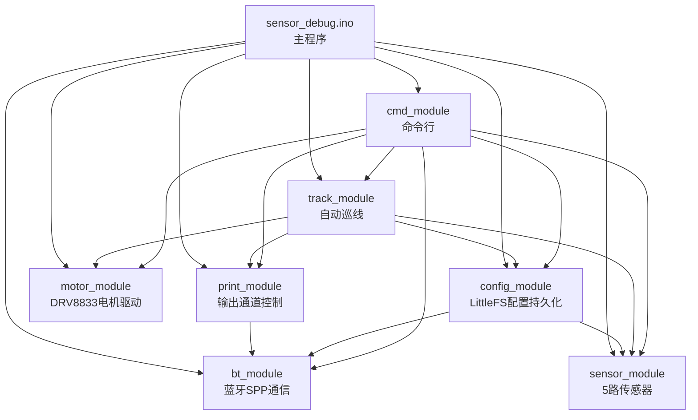

# 系统设计文档

记录硬件/软件设计决策、变更原因和风险评估。按主题分节，持续更新。

---

## R70急弯：外轮同步降速

**日期：** 2026-07-19

**背景：** 机械改造（传感器挪到轮轴50mm处）后实测：车速稍快，急弯直接冲出赛道；车速调到更慢，电机因静摩擦死区直接不走了——"能动"和"能过弯"这两个速度区间几乎没有重叠（详细分析见下方"软件模块设计"里track_module的问题记录）。

**根因：** 原来的急转逻辑（`SHARP_L`/`SHARP_R`）只反转内轮，外轮仍是和直行一样的`base`满速，车身带着直道的动能冲进急弯，转向力矩来不及在冲出赛道前把车头掰过来。

**改动：** 给急弯新增一个独立的"外轮速度比例"参数`_turn_outer_ratio`（track_module.cpp），触发`SHARP_L`/`SHARP_R`时外轮也降到`base * ratio`而不是维持满速，默认65%，运行时可调（不用重新烧录）：
- 新增BT/USB命令 `turnspeed N`（N=0~100，百分比），对应`track_set_turn_ratio()`
- 纳入`config_module`持久化（JSON新增`turn_ratio`字段），`save`命令一并保存，开机自动加载
- `speed`档位继续控制直道基准速度（解决"死区"问题的那个量），`turnspeed`只影响急弯瞬间的外轮（解决"过弯冲出去"的那个量），两者解耦，不用再用同一个全局速度硬扛两个矛盾的约束

**待办：**
- 实车测试`turnspeed`从65%开始调，观察R70能否通过、是否还会冲出去
- 若外轮降速仍不够，可能还需要"丢线冲出后自动倒车找线"这个后续方案（已讨论，未实现）

---

## 电机供电改造：升压至7V

**日期：** 2026-07-19

**改动：** 电机侧供电由单18650（3.7V）经升压模块稳压升到7V，直接给DRV8833 VM供电，目的是让电机性能变强。

**硬件参数：**

供电：单18650 → 升压模块 → 稳定7V → DRV8833 VM

电机：Tamiya 70168 双电机减速齿轮箱套件，电机型号为马夫奇FA-130
- 额定电压：1.5~3V（说明书标称工作电压3V，原装用2节AA电池）
- 空载电流：约0.15A（3V时）
- 堵转电流：约2.1A（3V时）

驱动：DRV8833
- VM工作电压范围：2.7~10.8V（TI规格书）
- 单通道额定电流：1.5A（连续）/ 2A（峰值，需良好散热铜皮才能达到）

**风险评估：**

7V约为电机额定电压的2.3倍，DRV8833本身电气上没问题（7V在2.7~10.8V安全区间内），但对电机是明显超压，有两个风险：

1. 电机寿命/发热：转速远超设计值，电刷/换向器磨损加快，绕组发热明显增加，长期连续跑容易烧线圈或电刷积碳打火。不会立刻炸，但寿命会大幅缩短。

2. 堵转电流可能超过DRV8833额定（更值得关注）：堵转电流大致正比于电压，3V时~2.1A，粗略换算到7V可能到4~5A，超过DRV8833单通道1.5A（连续）/2A（峰值）的额定值。track_module.cpp里急弯（SHARP_L/SHARP_R）会让内轮反转到-30%，这个瞬间是类堵转/急反转工况，正是电流冲击最大的时刻，也是最容易让DRV8833过流保护跳闸或过热损坏的场景。

**建议/待办：**
- 实测急转弯瞬间的电流（或卡住电机测堵转电流），确认是否接近或超过DRV8833的1.5~2A
- 如果PCB上DRV8833周围没有足够散热铜皮，2A峰值也未必扛得住，容易热保护自动断
- 折中方案：软件上把`motor_level_to_pwm`（motor_module.cpp）的PWM上限压低（比如封顶到180左右而不是255），相当于把最大有效电压限制在~5V左右，比原3V方案更有劲，又不会像满7V那样激进
- 电机摸起来烫手是过热信号，是电机寿命在倒计时的直接证据

**状态：** 已改造为7V供电，尚未实测电流，尚未加软件PWM上限保护。

---

## 软件模块设计

代码位于 `sensor_debug/`，Arduino项目，主程序 `sensor_debug.ino` + 7个功能模块（每个模块一对 `.h`/`.cpp`）。模块间以C函数接口通信，无全局状态共享（各模块内部用`static`变量封装私有状态）。

### 模块依赖关系

依赖是单向的，没有循环依赖。`sensor_module`/`motor_module`/`bt_module`是最底层，不依赖任何其他自定义模块；`print_module`只依赖`bt_module`（把BT作为一个输出通道）；`config_module`/`track_module`依赖底层模块做实际读写；`cmd_module`是最上层，几乎依赖所有模块，因为命令行要能操控整个系统。

### 各模块职责

**bt_module** — 蓝牙SPP通信封装
- 接口：`bt_begin(name)` / `bt_connected()` / `bt_send(msg)` / `bt_poll_line(buf, maxlen)`
- 内部维护一个64字节行缓冲区`_line_buf`，`bt_poll_line`做字符级读取，处理退格（0x08/0x7F）和回车换行，实现带回显的行读取，收到完整行返回true
- 是`print_module`和`cmd_module`共同依赖的底层通道

**print_module** — 数据流输出开关（区别于命令响应）
- 接口：`print_begin()` / `print_set_usb(bool)` / `print_set_bt(bool)` / `out(msg)` / `out_usb(msg)` / `out_bt(msg)`
- 内部两个bool开关`_usb`/`_bt`，默认都是false（开机不输出，需要`print on`手动开启）
- 用途：给高频/大量的调试数据流（传感器读数、track调试log）加开关，避免刷屏；命令响应走`cmd_module`自己的`reply()`，不经过这里，所以命令始终可见

**sensor_module** — 5路红外传感器
- 接口：`sensor_begin()` / `sensor_read(values[])` / `sensor_binary(is_white[])` / `sensor_position()` / `sensor_get_threshold(i)` / `sensor_set_threshold(i,v)`
- 引脚固定映射 `PINS[5] = {33,34,35,36,39}`（CH2~CH6），12位ADC分辨率
- 每路独立阈值`THRESHOLD[5]`，white=低于阈值（NPN光电晶体管active-low特性），阈值可被`config_module`加载的json覆盖，也可被`threshold`命令在线调整
- `sensor_position()`：只统计压白的传感器索引均值，归一化到-1~+1，全黑（丢线）返回NAN；因传感器物理反装180°，这里做了符号取反以保持-1仍代表物理最左

**motor_module** — DRV8833双路电机驱动
- 接口：`motor_begin()` / `motor_stop()` / `motor_brake()` / `motor_set(pwm_l, pwm_r)` / `motor_level_to_pwm(level)`
- 4根PWM引脚（IN1~IN4）+ 1根使能引脚EEP，每侧电机用两根同极性引脚实现正反转（一根给PWM另一根拉低=正转，反过来=反转）
- `motor_level_to_pwm`：1~40档线性映射到0~255 PWM占空比，是`config_module`存的"速度档位"和实际PWM之间的唯一换算点
- 不感知电压（3.7V/7V切换对这一层透明），纯粹是占空比计算

**config_module** — LittleFS + JSON 配置持久化
- 接口：`config_begin()` / `config_get_speed()` / `config_set_speed(level)` / `config_save()` / `config_print()`
- 持久化三类数据：速度档位（int，自己持有）+ 急弯外轮比例（float，通过`track_module`的get/set读写）+ 5路阈值（数组，通过`sensor_module`的get/set threshold读写），阈值和急弯外轮比例自己都不存副本，只做json↔模块内变量的搬运
- 开机`config_begin()`挂载LittleFS、读`/config.json`，文件不存在或字段缺失则保留默认值（速度12，阈值用sensor_module内置默认）
- `config_save()`是唯一写入Flash的入口，`config_set_speed`/`sensor_set_threshold`只改内存，需要显式`save`命令持久化

**track_module** — 自动巡线（三级差速转向，非PID）
- 接口：`track_begin()` / `track_set(bool)` / `track_is_on()` / `track_update()` / `track_get_turn_ratio()` / `track_set_turn_ratio(float)`
- 核心状态机在`track_update()`，每次loop调用一次，非阻塞：
  - 读5路二值状态，映射为`sharp_l/mild_l/center/mild_r/sharp_r`（因传感器反装，index 0↔CH2对应物理右侧，index 4↔CH6对应物理左侧）
  - 判定优先级：丢线(lost) > 十字路口/宽线(cross) > 急转(sharp) > 缓转(mild) > 直行(center/默认)
  - 差速通过修改单侧PWM实现：缓转内轮减速50%（`TURN_RATIO_MILD`），急转内轮反转30%（`TURN_RATIO_SHARP`）+ 外轮同步降速到`_turn_outer_ratio`（默认65%，运行时可调，见`turnspeed`命令），应对R70急弯——外轮全速会带着直道动能冲进弯道，同步降速减少入弯动能
  - 丢线后用`_last_dir`延续上次转向方向找线，超过`LOST_TIMEOUT_MS`(1.5s)仍找不到则停车
  - 内置调试log（`DEBUG_INTERVAL_MS`节流），走`out()`所以受`print_module`开关控制
- 依赖`config_module`取当前速度档位算基准PWM，依赖`motor_module`下发实际PWM；`_turn_outer_ratio`被`config_module`读写用于持久化（对称于`sensor_module`的阈值模式）

**cmd_module** — 命令行（USB+BT统一处理）
- 接口：`cmd_begin()` / `cmd_poll()`
- 内部各自维护一份行缓冲区（BT走`bt_poll_line`，USB自己实现了一份等价的`serial_poll_line`，两者逻辑重复但故意不合并成一个模块，因为Serial和BluetoothSerial是不同的Arduino对象类型）
- `handle_command()`是一个大的`if-else`字符串匹配分发器，命令集：print/stop/track/speed/turnspeed/save/config/threshold/go/back/spin left/spin right/help
- 响应通过`reply()`直接走`Serial.print`+`bt_send`，不经过`print_module`的开关，所以命令交互始终可见，不受"数据流开关"影响
- `go`/`back`/`spin`系列命令内部用`delay()`阻塞N秒后停车——这几个是唯一会阻塞主循环的命令，用于手动测试电机/巡线以外的动作，测试期间`cmd_poll`/`track_update`都不会执行

**sensor_debug.ino（主程序）**
- `setup()`：关闭欠压检测 → 初始化LED/按钮引脚 → 按顺序`print_begin → sensor_begin → motor_begin → config_begin → track_begin → bt_begin` → 打印一次`config_print()` → `cmd_begin()`
- `loop()`非阻塞轮询顺序：LED状态同步蓝牙连接 → `cmd_poll()`处理命令 → Boot按钮消抖切换track on/off → `track_update()` → 每200ms打印一次传感器原始数据（受`print_module`控制）
- Boot按钮（GPIO0）是唯一不经过命令行、直接切换巡线开关的物理入口

### 关键设计约定

1. **两套输出通道，语义不同**：`print_module`控制的是"数据流"（高频、可关闭，如传感器读数、track调试log），`cmd_module`的`reply()`是"命令响应"（始终可见，不受开关影响）。新增输出前要想清楚属于哪一类。
2. **配置写入分两步**：所有`set`类接口（`config_set_speed`、`sensor_set_threshold`）只改内存，必须显式调用`config_save()`才落盘到`/config.json`，避免频繁写Flash。
3. **物理左右映射在两处独立处理**：`sensor_module.cpp`的`sensor_position()`和`track_module.cpp`的index分配，两处都因传感器180°反装做了各自的符号/顺序调整，修改任一处时要同时检查另一处是否也需要同步（`README.txt`开头有详细记录）。
4. **速度档位是唯一的电机强度旋钮**：所有驱动电机的命令（`go`/`back`/`spin`/`track`）都通过`config_get_speed()` + `motor_level_to_pwm()`换算PWM，没有独立的每命令速度参数，改速度只需要改一处。
