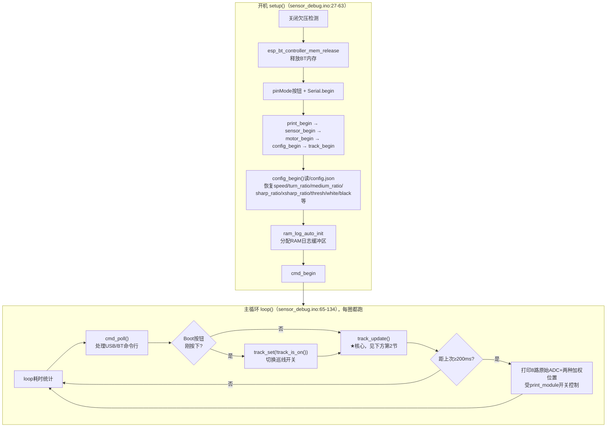
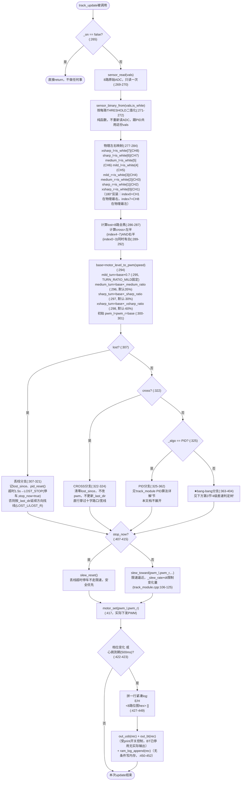
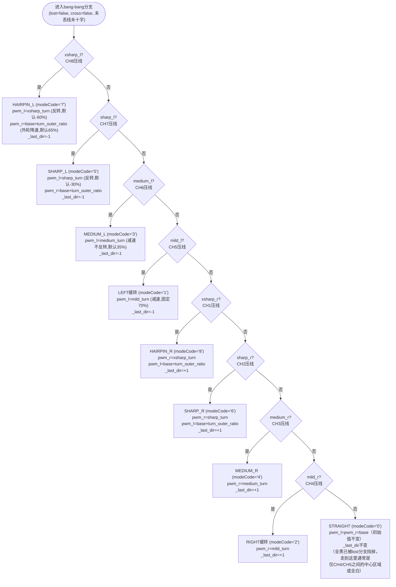

# 主程序→bang-bang算法调用流程

**日期：** 2026-07-31

本文档梳理从`sensor_debug.ino`开机/主循环，到`track_module.cpp`里bang-bang差速分支
真正把PWM下发给电机为止的完整调用链，只覆盖当前默认算法**bang-bang**这一条路径
（`algo=0`）；PID分支（`algo=1`）不在本文档展开，见"设计说明.md"的"track_module PID
算法详解"节和"8路模拟PID算法.md"。硬件背景（8路传感器、BT停用）见"设计说明.md"。

---

## 1. 一图看懂：从开机到电机转动



`track on`可以由两个入口触发，两者最终都调同一个`track_set(bool)`：
- **命令行**：USB/BT敲`track on`/`track off` → `cmd_module.cpp`的`handle_command()`
  → `track_set(true/false)`
- **物理按钮**：GPIO0(Boot按钮)消抖后 → `sensor_debug.ino:96` → `track_set(!track_is_on())`

`track_set(true)`（`track_module.cpp:205-258`）做的事：清空`_last_dir`/`_lost_since`、
调`pid_reset()`/`slew_reset()`清掉残留状态、调`ram_log_begin()`清空内存日志缓冲区并
写入`TRACK_ON`+`PARAMS`两条标记行（`config_build_params_line()`生成当前生效的全部
参数快照）。`track on`之后，每次`loop()`都会调用一次`track_update()`，这是bang-bang
真正被执行的地方。

---

## 2. `track_update()` 内部详细流程（`track_module.cpp:264-454`）



---

## 3. bang-bang分支：8路4级差速判定树（`track_module.cpp:363-404`）

`_algo != TRACK_ALGO_PID`时，且未丢线、未在十字路口，进入这一段：由外到内依次判断，
**命中最外层就不再看内层**（`if / else if`短路），对称的左右各4档：



**关于"由外到内"的含义**：从最外侧的CH1/CH8（发卡弯）到最内侧的CH4/CH5（缓转）依次
判断，只要外层命中就不再看内层——例如CH8和CH6同时压线时，只会触发`HAIRPIN_L`，`
medium_l`那一档完全不会被看到。这是判定优先级设计的核心：**车头偏得越狠，越需要最
外层最激进的修正**，内层的档位只在外层都没压线时才轮到。

**8路顺序与物理左右对应关系**（因传感器180°反装）：

```
物理左 ← CH8   CH7   CH6   CH5  |  CH4   CH3   CH2   CH1 → 物理右
        (idx7)(idx6)(idx5)(idx4) (idx3)(idx2)(idx1)(idx0)
        发卡弯 急转  中转  缓转     缓转  中转  急转  发卡弯
```

---

## 4. 关键代码位置速查表

| 内容 | 位置 |
|---|---|
| 主程序开机顺序 | `sensor_debug.ino:27-63` |
| 主循环调用顺序 | `sensor_debug.ino:65-134` |
| track on/off触发（按钮） | `sensor_debug.ino:92-101` |
| track on/off触发（命令行） | `cmd_module.cpp`：`"track on"`/`"track off"`分支 |
| `track_set()`实现 | `track_module.cpp:205-258` |
| `track_update()`总入口 | `track_module.cpp:264` |
| 8路ADC采样+二值化（只采样一次） | `track_module.cpp:269-272` |
| 物理左右映射（8路index翻转） | `track_module.cpp:277-284` |
| lost/cross判定 | `track_module.cpp:286-292` |
| base/各档PWM预计算 | `track_module.cpp:294-301` |
| 丢线分支 | `track_module.cpp:307-321` |
| 十字路口分支 | `track_module.cpp:322-324` |
| PID分支（本文档不展开） | `track_module.cpp:325-362` |
| **bang-bang 4级差速分支** | `track_module.cpp:363-404` |
| PWM限速（slew） | `track_module.cpp:106-125`（`slew_toward`实现），`:406-415`（调用点） |
| 电机下发 | `motor_module.cpp:42-59` `motor_set()`；`track_module.cpp:417`调用点 |
| 速度档位→PWM换算 | `motor_module.cpp:11-15` `motor_level_to_pwm()`（1~40线性映射到0~255） |
| 事件/心跳日志拼装与输出 | `track_module.cpp:419-453` |
| 各转向比例默认值 | `track_module.cpp:16-30`（`TURN_RATIO_MILD`固定0.7、`TURN_RATIO_MEDIUM_DEFAULT`=0.35、`TURN_RATIO_SHARP_DEFAULT`=-0.3、`TURN_RATIO_XSHARP_DEFAULT`=-0.6、`TURN_OUTER_RATIO_DEFAULT`=0.65） |
| 8路阈值/白黑参考值 | `sensor_module.cpp:6-19`（`PINS`/`THRESHOLD`/`WHITE_REF`/`BLACK_REF`） |

---

## 5. 一次调用只读一次传感器，两种算法共用同一份采样

`track_update()`开头只调一次`sensor_read(vals)`+`sensor_binary_from(vals,is_white)`
（`:269-272`），后面无论走丢线/十字路口/bang-bang/PID哪个分支，都复用这同一份
`vals[]`/`is_white[]`，不会在一次`loop()`里对8路传感器重复采样——这是2026-07-22
修复"打印代码多次独立采样导致log自相矛盾"问题后延续下来的设计约定（PID分支的
`sensor_position_analog_from(vals)`同样吃这份`vals`，不重新读ADC），改动这段代码时
需要保持这个约定，不要在某个分支里又调一次`sensor_read()`/`sensor_binary()`。

---

## 相关文档

- 8路传感器物理布局、引脚映射、4级差速的设计取舍：**8路传感器方案.md**
- PID分支的详细算法分析：**8路模拟PID算法.md**、设计说明.md的"track_module PID算法详解"节
- PWM限速(`slewrate`)设计背景：设计说明.md的"PWM限速（slewrate），压制左右摇摆"节
- 硬件引脚、命令行完整列表：设计说明.md的"硬件参考"、"代码结构与命令参考"节
