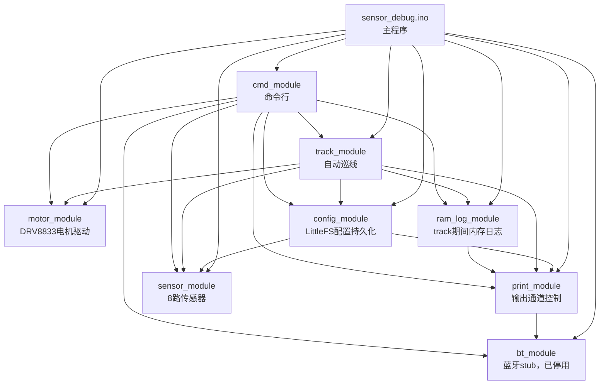
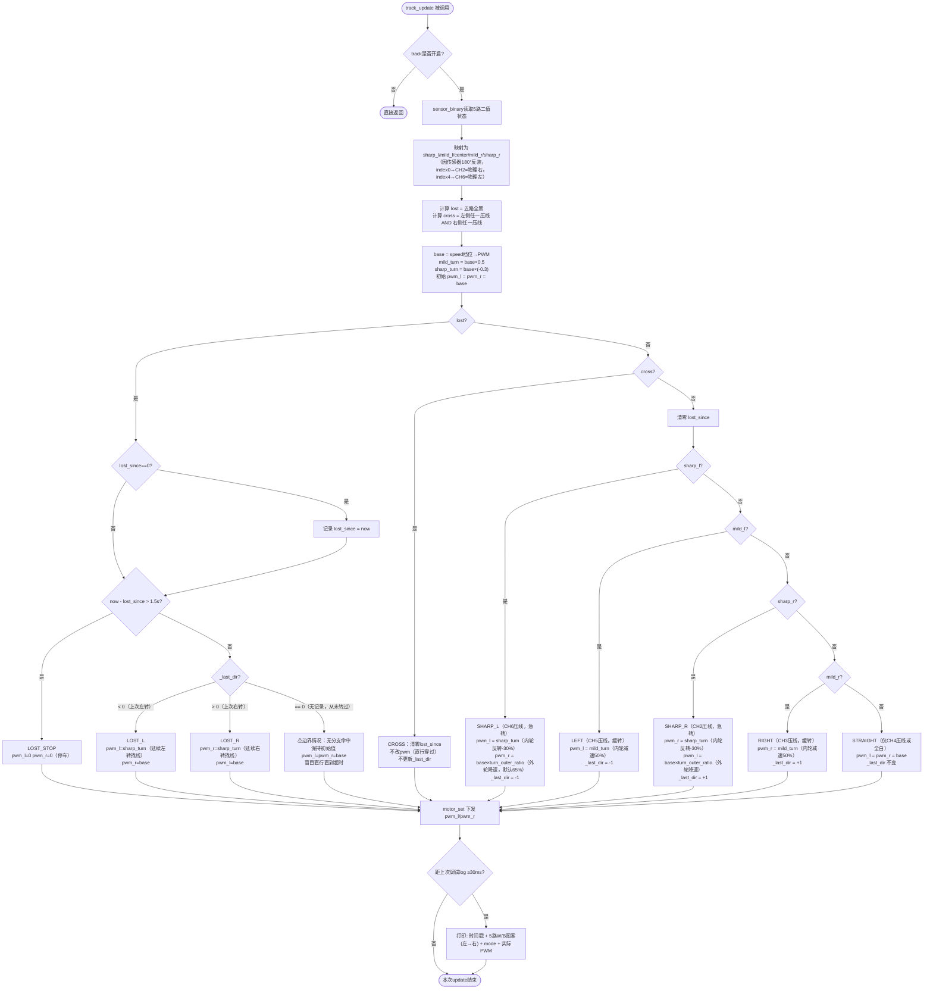

# 系统设计文档

记录硬件/软件设计决策、变更原因和风险评估，以及硬件/命令速查参考。按主题分节，持续更新。
（2026-07-22起本项目文档统一维护在这一份文件里，不再使用README.txt）

---

## 硬件参考

### 硬件平台
- 主控：ESP32（Arduino IDE开发）
- 传感器：AE-NJL5901AR-8CH（8路红外反射传感器），传感器间距16mm
- 电机驱动：DRV8833
- 比赛线宽：19mm（白线）

### 引脚定义（PCB固定，不可修改）

传感器（AE-NJL5901AR-8CH）：

| 通道 | 引脚 | ADC | 使用 |
|---|---|---|---|
| CH1 | D32 | ADC1 | ← 使用 |
| CH2 | D33 | ADC1 | ← 使用 |
| CH3 | D34 | ADC1 | ← 使用 |
| CH4 | D35 | ADC1 | ← 使用 |
| CH5 | VP(GPIO36) | ADC1 | ← 使用 |
| CH6 | VN(GPIO39) | ADC1 | ← 使用 |
| CH7 | D13 | ADC2 | ← 使用 |
| CH8 | D14 | ADC2 | ← 使用 |

注：CH7/CH8挂在ADC2上，之前因为BT开启时ADC2读数会出错而一直禁用。2026-07-31起
BT已彻底停用（见下方"BT彻底停用"节），这个冲突不再存在，CH1/CH7/CH8连同原来就在
用的CH2~CH6一起全部接入代码，8路传感器现在全部使用（8路布局/映射详见"8路传感器方案.md"）。

电机驱动（DRV8833）：
- GPIO17 → EEP 使能（HIGH=工作，LOW=睡眠）
- GPIO18 → IN1 右电机 / GPIO19 → IN2 右电机
- GPIO21 → IN3 左电机 / GPIO22 → IN4 左电机

其他：
- GPIO0 → Boot按钮（按一下切换track on/off，物理开关）

注：原GPIO2板载LED跟随`bt_connected()`显示蓝牙连接状态的功能已随BT一起移除——
BT彻底停用后不再有"已连接/未连接"这个状态可显示，`sensor_debug.ino`里不再有相关代码。

### 传感器说明
- 8路全部使用：CH1~CH8，间距16mm，左右对称（详见"8路传感器方案.md"）
- 输出特性：白色=低值，黑色=高值（NPN光电晶体管active-low）
- 阈值/白黑参考值（各路独立，代码内默认值，均可被`/config.json`覆盖，也都能被
  `threshold`/`whiteref`/`blackref`命令在线调整）：

| 通道 | 二值判断阈值(threshold) | 白参考值(white_ref) | 黑参考值(black_ref) | 备注 |
|---|---|---|---|---|
| CH1(D32) | 1545 | 600 | 2400 | **占位值，未实车校准** |
| CH2(D33) | 1545 | 660 | 2400 | 已实测校准（沿用原5路方案的实测值） |
| CH3(D34) | 1580 | 660 | 2500 | 已实测校准 |
| CH4(D35) | 1422 | 545 | 2300 | 已实测校准 |
| CH5(VP36) | 1400 | 600 | 2200 | 已实测校准 |
| CH6(VN39) | 1115 | 600 | 2400 | 已实测校准 |
| CH7(D13) | 1500 | 600 | 2400 | **占位值，未实车校准（新增通道）** |
| CH8(D14) | 1500 | 600 | 2400 | **占位值，未实车校准（新增通道）** |

注：white_ref/black_ref是给PID模式的模拟量加权误差用的（`sensor_position_analog_from()`，
见"track_module PID算法详解"节和"8路模拟PID算法.md"），threshold是给bang-bang和丢线/十字
路口判定用的二值阈值，两套值概念不同、需要分别标定。CH1/CH7/CH8是2026-07-31新增接入
的3路，代码里的值全是占位未校准值，**烧录后第一步就是`print on`看这3路原始ADC白/黑值，
再用`threshold`+`whiteref`+`blackref`逐路标定并`save`**，否则这3路的判断/PID误差不可信。
实际跑的是`/config.json`里`save`过的值，不一定等于上表代码默认值。

### 电源
双18650方案：
- 电池1 → 升压5V → ESP32 + 传感器
- 电池2 → DRV8833 → 电机（**3.7V直接供电，不经过升压**，目前实测就是这个接法；曾经计划过升压到7V，
  该改造未采用/已撤销，详见下方"电机供电改造：升压至7V"节，那节内容仅作历史记录）

注意：上电瞬间电压抖动，代码中关闭欠压检测器：`WRITE_PERI_REG(RTC_CNTL_BROWN_OUT_REG, 0);`

---

## 代码结构与命令参考

### 目录结构
```
sensor_debug/
├── sensor_debug.ino      主程序入口
├── bt_module.h/cpp       蓝牙模块（2026-07-31起为空实现stub，BT彻底停用，见下方"BT彻底停用"节）
├── print_module.h/cpp    输出控制模块（USB/BT/Flash文件三通道，文件通道是多段环形缓冲区）
├── sensor_module.h/cpp   传感器模块（8路）
├── motor_module.h/cpp    电机模块
├── config_module.h/cpp   配置持久化模块（LittleFS+JSON）
├── track_module.h/cpp    自动巡线模块（bangbang/pid双算法，运行时可切换）
├── ram_log_module.h/cpp  track运行期内存日志缓冲区（2026-07-31新增，见"LOG精简方案.md"）
└── cmd_module.h/cpp      命令行模块
```
各模块职责、接口、依赖关系详见下方"软件模块设计"节。

### USB/BT命令列表

BT已彻底停用（`bt_send`/`bt_poll_line`等是空实现，见下方"BT彻底停用"节），下表里涉及BT的
命令仍然存在（不会报错），但实际不会有任何BT输出/输入，现场只能用USB。

| 命令 | 说明 |
|---|---|
| `print on/off` | USB+BT 数据流同时开关（BT那部分已停用，实际只影响USB） |
| `print usb on/off` | 仅控制USB数据流 |
| `print bt on/off` | 仅控制BT数据流（BT已停用，实际不生效） |
| `print file on/off` | 仅控制文件数据流（写入`/track.log.0~3`多段环形缓冲区），仅内存生效，需`save`才持久化开关状态 |
| `go N` | 前进N秒（1~60），使用当前速度 |
| `back N` | 后退N秒（1~60），使用当前速度 |
| `spin left/right N` | 原地旋转N秒（1~60），测试最小转弯半径用 |
| `stop` | 立即停止电机（同时会退出巡线模式） |
| `track on/off` | 开启/关闭自动巡线；log改走RAM缓冲区（track on~off全程只写内存，off时才备份进flash），见"track运行期内存日志"节 |
| `speed N` | 设置速度档位（1~40，默认12），仅内存生效，需`save`才写入Flash |
| `turnspeed N` | 设置急转/发卡弯外轮速度比例（0~100%，默认65），仅内存生效，需`save`才写入Flash |
| `mediumratio N` | 设置中转（CH3/CH6）内轮速度比例（0~100%，默认35，不反转），仅内存生效，需`save`才写入Flash |
| `sharpratio N` | 设置急转（CH2/CH7）内轮反转比例（0~100%，默认30），仅内存生效，需`save`才写入Flash |
| `xsharpratio N` | 设置发卡弯（CH1/CH8）内轮反转比例（0~100%，默认60，比急转更激进），仅内存生效，需`save`才写入Flash |
| `algo 0/1` | 切换巡线算法（0=bangbang，1=pid，默认0），仅内存生效，需`save`才写入Flash |
| `pid kp/ki/kd N` | 设置PID三个增益（浮点数，默认Kp=40.0/Ki=0.0/Kd=5.0），仅内存生效，需`save`才写入Flash |
| `slewrate N` | 设置PWM限速值（float，每秒最多变化多少PWM单位，默认800），仅内存生效，需`save`才写入Flash |
| `whiteref CH VALUE` | 设置CHx(1~8)模拟量加权用的白参考值（PID误差来源标定），仅内存生效，需`save`才写入Flash |
| `blackref CH VALUE` | 设置CHx(1~8)模拟量加权用的黑参考值，仅内存生效，需`save`才写入Flash |
| `threshold CH VALUE` | 设置CHx(1~8)的二值判断阈值，仅内存生效，需`save`才写入Flash |
| `save` | 把当前所有可调参数（速度/turnspeed/mediumratio/sharpratio/xsharpratio/算法/PID三个增益/PWM限速/文件log开关/8路阈值/8路白黑参考值）保存到`/config.json` |
| `config` | 打印当前配置的JSON内容 |
| `mem` | 打印剩余堆内存、最大可分配连续块、ram log缓冲区实际分到的大小 |
| `log dump` | 把当前RAM日志缓冲区内容（最近一次track on~off，还没off也能看到目前为止的内容）直接打印到Serial，不经过flash |
| `log clear` | 清空所有`/track.log.0~3`段文件，#ID归零 |
| `log status` | 查看文件log开关状态、总容量、下一个#ID、是否已绕回覆盖过最老的段 |
| `log format` | 打印事件行/心跳行格式说明+modeCode编码表 |
| `help` | 显示命令帮助 |

注：开机自动从`/config.json`加载所有可调参数；文件不存在或无该字段时用默认值。
注：速度档位2026-07-08起从1~10改为1~40（分辨率×4，原N档=新N×4档），旧`/config.json`里
保存的speed字段是旧档位数值，升级后含义已变，需要重新用`speed`命令设置并`save`。

### 依赖库（Arduino Library Manager安装）
- ArduinoJson（Benoit Blanchon，v6）← config_module使用
- LittleFS 为ESP32核心自带，无需安装
- BluetoothSerial **不再需要**：BT彻底停用后`bt_module.cpp`不再`#include`它，也不再实例化
  `BluetoothSerial`对象，链接产物里不会再包含经典BT/Bluedroid协议栈那部分代码（见下方
  "BT彻底停用"节）

---

## 待完成清单

- **CH1/CH7/CH8的threshold/whiteref/blackref目前都是占位未校准值**，这是2026-07-31
  新增接入的3路，烧录后第一步必须做：`print on`实测这3路原始ADC白/黑值→逐路
  `threshold CH VALUE`+`whiteref CH VALUE`+`blackref CH VALUE`→`save`，否则这3路
  参与的判断（xsharp发卡弯、cross十字路口、PID模拟量误差）都不可信，优先级最高
- `mediumratio`(默认35%)、`xsharpratio`(默认60%)是4级差速里新增的两档，纯起调猜测值，
  完全没有实车验证过，需要现场试调（详见"8路传感器方案.md"）
- PID模式误差来源2026-07-29已从二值判断换成模拟量加权（`sensor_position_analog_from`），
  Kp/Ki/Kd增益需要按新的误差信号重新试调（当前`/config.json`实测用的是Kp100/Kd0，
  代码默认是Kp40/Kd5，两者哪个更合适还没有定论，详见"8路模拟PID算法.md"）
- 公司比赛赛道还没实测过，目前所有结论（R70、sharpratio调参、8路扩展等）只在自建赛道上成立
- track运行期日志已从"边跑边写flash"改为"全程只写RAM、track off时才备份进flash"
  （2026-07-31，见"track运行期内存日志"节和"LOG精简方案.md"），分块malloc的RAM缓冲区
  容量、track off落盘耗时都还没有在实车长时间运行下验证过
- `print_file_dump()`（`print_module.cpp`，按flash段0..N-1顺序整份打印）目前没有任何
  命令行入口调用——`log dump`命令已经改成调`ram_log_dump()`直接读内存，这个函数是
  当前的死代码，待确认是保留（万一以后想直接从flash读旧数据）还是删除
- BT已经彻底停用（不是"待排查根因"，是主动移除，见"BT彻底停用"节），如果以后重新
  需要BT，需要按`bt_module.cpp`/`sensor_debug.ino`里的注释走完整恢复流程（换回真实
  BluetoothSerial实现+删掉`esp_bt_controller_mem_release()`+取消`bt_begin()`注释）

---

## R70急弯：外轮同步降速

**日期：** 2026-07-19

**背景：** 机械改造（传感器挪到轮轴50mm处）后实测：车速稍快，急弯直接冲出赛道；车速调到更慢，电机因静摩擦死区直接不走了——"能动"和"能过弯"这两个速度区间几乎没有重叠（详细分析见下方"软件模块设计"里track_module的问题记录）。

**根因：** 原来的急转逻辑（`SHARP_L`/`SHARP_R`）只反转内轮，外轮仍是和直行一样的`base`满速，车身带着直道的动能冲进急弯，转向力矩来不及在冲出赛道前把车头掰过来。

**改动：** 给急弯新增一个独立的"外轮速度比例"参数`_turn_outer_ratio`（track_module.cpp），触发`SHARP_L`/`SHARP_R`时外轮也降到`base * ratio`而不是维持满速，默认65%，运行时可调（不用重新烧录）：
- 新增BT/USB命令 `turnspeed N`（N=0~100，百分比），对应`track_set_turn_ratio()`
- 纳入`config_module`持久化（JSON新增`turn_ratio`字段），`save`命令一并保存，开机自动加载
- `speed`档位继续控制直道基准速度（解决"死区"问题的那个量），`turnspeed`只影响急弯瞬间的外轮（解决"过弯冲出去"的那个量），两者解耦，不用再用同一个全局速度硬扛两个矛盾的约束

**待办：**
- 实车测试`turnspeed`从65%开始调，观察R70能否通过、是否还会冲出去
- 若外轮降速仍不够，可能还需要"丢线冲出后自动倒车找线"这个后续方案（已讨论，未实现）

---

## 参数调优记录：sharpratio -30%→-40%

**日期：** 2026-07-22

**背景：** `log分析/log-2.txt`（自建赛道，46.6秒连续巡线，详见`log分析/log-2-分析报告.txt`）
分析发现两次丢线时长逼近`LOST_TIMEOUT_MS`(1500ms)上限的情况，均为`SHARP_R→LOST_R`
（右转弯后长时间找不到线）：T1107117~1108497约1380ms（余量120ms）、
T1122087~1123407约1320ms（余量180ms）。虽然两次都在超时前重新压回线上没有真正
触发`LOST_STOP`，但余量偏薄，属于隐患而非已确认的失败。

为此新增了`sharpratio`命令（对应`_sharp_ratio`，原来是硬编码`TURN_RATIO_SHARP`
常量，现在跟`turnspeed`一样运行时可调+持久化，见"软件模块设计"里track_module的
相关记录），目的是加大急弯内轮反转力度，让车头更快甩过弯，缩短丢线时长。

**改动（本轮只改了一个参数）：**

调整前（log-2.txt实测时的参数，`sharp_ratio`为代码默认值-0.3，未曾调过）：
```json
{"speed":16,"turn_ratio":0.65,"sharp_ratio":-0.3,"threshold":[1546,1580,1422,1400,1500]}
```

调整后（实车执行`sharpratio 40` + `save`）：
```json
{"speed":16,"turn_ratio":0.65,"sharp_ratio":-0.4,"threshold":[1546,1580,1422,1400,1500]}
```

只有`sharp_ratio`从-0.3变成-0.4（急弯内轮反转力度从30%加大到40%），
`speed`/`turn_ratio`/5路阈值均未变。

**效果：** 用户实车（仍是自建赛道）测试反馈"效果还可以"——这是定性判断，
目前没有配套的新log文件做量化对比，无法确认之前那两处逼近超时的LOST_R具体
缩短了多少。

**待办：**
- 如需量化验证，按跟log-2同样的方式（`print bt on` + `track on`）跑一遍并导出
  日志（存成`log分析/log-3.txt`），可以直接对比同样两个弯（右转SHARP_R→LOST_R）
  这次丢线时长是否比log-2的1320~1380ms明显缩短，以及有没有引入新问题
  （比如内轮反转力度加大后是否出现打滑、左转是否受影响）
- 仍未在公司比赛赛道实测，这轮调参的结论只在自建赛道上成立

---

## 新增PID算法，与bangbang并列可切换

**日期：** 2026-07-22

**背景：** track_module原本只有一种算法——基于5路离散白/黑状态、按优先级判定的三级
差速bang-bang控制（详见"软件模块设计"里track_module的算法确认与流程图）。用户要求
增加一个PID算法作为可选项，默认仍是bangbang，可通过参数切换，方便对比哪种更平稳。

**设计取舍：**

1. **误差从哪来**：`sensor_module.cpp`本来就有一个连续加权位置`sensor_position()`
   （-1.0~+1.0），但之前只用于`print on`的调试打印，`track_update()`控制路径完全
   没用到它。PID正好需要这个连续误差量，直接复用。
2. **避免重复采样**：`sensor_position()`内部会自己调一次`sensor_binary()`重新读
   ADC，如果PID模式直接调它，就会在`track_update()`一个loop周期里对5路传感器采样
   两次（开头`sensor_binary(is_white)`一次，PID分支`sensor_position()`又一次），
   跟log-1分析报告里发现的"打印代码多次独立采样导致log自相矛盾"是同一类问题，还会
   拖慢控制周期。为此把`sensor_position()`拆成了一个纯函数`sensor_position_from
   (is_white[])`，PID分支直接传入`track_update()`开头已经读好的那份`is_white[]`，
   只采样一次。
3. **算法切换点**：`lost`（丢线）和`cross`（十字路口/宽线）两个判定继续用原来的
   离散布尔状态、两种算法共用，不区分bangbang/pid——这两个是"异常状态处理"，没有
   必要为PID单独做一套，丢线时依然延续`_last_dir`方向反转找线（沿用bang-bang的
   `sharp_turn`），超时1.5s停车逻辑也不变。只有"五路里有白线、不丢线也不是十字
   路口"这个正常跟踪分支，才按`_algo`分岔成bangbang优先级判定 或 PID闭环两条路。
4. **PID输出直接是PWM差速修正量**，不做归一化：`output = Kp*error + Ki*积分 +
   Kd*微分`，`pwm_l = base + output`、`pwm_r = base - output`（error>0=线偏右
   →左轮加速/右轮减速），最后clamp到±255防止溢出。这样Kp的量纲直接是"每单位误差
   对应多少PWM"，跟bang-bang里`sharp_turn`/`mild_turn`的PWM直觉一致，方便调参时
   类比（比如error=1时Kp*1应该跟`sharp_turn`的量级差不多）。
5. **积分限幅+状态重置**：积分项限幅±2.0防止长时间小误差累积失控（抗积分饱和）；
   `track_set(on)`开关巡线、`track_set_algo()`切换算法、进入`lost`状态时都会清空
   PID的积分/微分历史，避免带着丢线期间或上一次运行的陈旧误差数据继续算，冲一把。

**参数（均运行时可调，纳入config_module持久化）：**
- `algo 0` / `algo 1`：切换算法（0=bangbang，1=pid），默认0（2026-07-31起命令从
  `algo bangbang`/`algo pid`简化为数字，见"命令行简化：algo改数字"节）
- `pid kp N` / `pid ki N` / `pid kd N`：浮点数，默认Kp=40.0 / Ki=0.0 / Kd=5.0

**风险与待办：**
- 三个PID默认增益（Kp40/Ki0/Kd5）和积分限幅(±2.0)都只是起调参考值，**完全没有
  实车验证过**，跟当年`TURN_RATIO_SHARP`/`TURN_OUTER_RATIO_DEFAULT`第一次给默认值
  时一样，需要实车从这个起点开始试调，不能直接当作可用参数
- 还没和bangbang在同一条赛道上做过对比测试，不知道PID实际是否比bang-bang更平稳，
  这正是用户想通过新增这个算法来验证的问题，待实测
- Kd项对传感器噪声敏感（丢线边缘、阈值抖动都会在error上产生突变，微分会放大），
  如果实车测试发现车身抖动明显，优先怀疑Kd偏大

---

## PWM限速（slewrate），压制左右摇摆

**日期：** 2026-07-29

**背景：** 实车测试中反复出现"冲出跑道"的情况，排查过程中（详见`log分析/log5分析.md`、
`log分析/log6分析.md`）依次确认并修复了两个问题：Flash环形log的flush耗时过长拖慢
控制环（改成多段文件顺序追加）、PID重写后固定周期+微分低通滤波（消除微分对离散
信号的噪声放大）。这两个都修完之后，用户反馈bang-bang比之前稳定了一些，但**依然会
"左右摇摆剧烈"最终冲出跑道**；同时PID模式在`Kp=40`时转向权威不足反复丢线，
`Kp=100`时又变成剧烈画龙冲出去——说明当前架构下，纯提高或降低某个增益都无法根治
"摇摆/画龙"这个表现。

**根因**：不管是bang-bang还是PID，下发给电机的目标PWM都是在检测状态变化的瞬间
**硬跳变**的——比如bang-bang从`STRAIGHT`(base=102)直接跳到`SHARP_L`(内轮反转到
`sharp_turn`，比如-40)，中间没有任何过渡；PID在误差跳档、或Kp调大之后，同样的问题
更明显（差速修正量本身被放大）。车身在检测边界附近来回穿越时，会跟着这种硬跳变来回
打，就是"摇摆/画龙"的直接成因，而且这个问题不受"改进log"或"重写PID计算"这两轮
修复影响——因为它出在两种算法共同的最后一步：把算好的`pwm_l`/`pwm_r`直接下发给
`motor_set()`。

**改动**：在`track_update()`末尾、`motor_set()`之前，新增一个限速环节
（`track_module.cpp`的`slew_toward()`），把目标PWM改成**限速逼近**——每次调用最多
允许当前下发值朝目标值变化`_slew_rate × dt`个单位（`dt`是本次调用距上次的真实
间隔，用`millis()`实测，不是固定步长），而不是直接跳变到目标值。两种算法都受益，
统一处理，不需要分别改bang-bang和PID各自的分支。

**例外**：丢线超时停车（`LOST_STOP`）不走限速，直接停——安全优先，不能因为限速
而拖慢真正需要停车的反应。

**参数（运行时可调，纳入config_module持久化）：**
- `slewrate N`：float，默认800（单位：PWM/秒）

**权衡（未实车验证，需要试调）：**
- 数值越小，摇摆压得越狠，但对真正的急弯反应也会变慢——按默认800算，从
  `base=102`跳到`sharp_turn=-40`（差142个单位）大约需要`142/800≈0.18秒`才能
  完全到位，这段时间车头还没转到位；如果这个延迟导致发卡弯（R70~75mm）来不及
  打满转向、直接冲出去，需要调大`slewrate`
- 数值越大越接近不限速，直道上的摇摆问题会重新出现
- 800只是起调参考值，跟`sharp_ratio`/`pid kp`这些参数一样需要实车从这个起点开始
  试调，尚未验证具体数值

---

## 8路传感器扩展：5路→8路，2级→4级差速

**日期：** 2026-07-31

**背景：** 传感器模块`AE-NJL5901AR-8CH`本来就是8路一体，之前只接了中间5路（CH2~CH6），
CH1没接进代码（可用但没用），CH7/CH8挂在ADC2上，BT开启时ADC2读数会出错所以一直标记
"不可用"。BT彻底停用（见下一节）解除了ADC2这个限制，于是把CH1/CH7/CH8也接进代码，
凑齐全部8路，传感器有效跨度从原来4×16=64mm扩大到7×16=112mm。

**改动：**
- `sensor_module.h/cpp`：`SENSOR_COUNT`从5改成8，`PINS[]`按CH1→CH8顺序排列
  `{32,33,34,35,36,39,13,14}`；新增`THRESHOLD`/`WHITE_REF`/`BLACK_REF`三个数组里
  CH1/CH7/CH8的占位条目（未校准，见"传感器说明"节）
- `track_module.cpp`：bang-bang从原来的"缓转/急转"2级差速扩展为"缓转(mild,CH4/CH5)/
  中转(medium,CH3/CH6,新增)/急转(sharp,CH2/CH7)/发卡弯(hairpin,CH1/CH8,新增)"4级差速，
  由外到内依次判定，命中最外层就不再看内层；新增`mediumratio`/`xsharpratio`两个运行时
  可调参数（对称于原有的`sharpratio`/`turnspeed`）
- `config_module.cpp`：持久化字段新增`medium_ratio`/`xsharp_ratio`/`white_ref`/
  `black_ref`（后两个是8元素数组）；`threshold`/`white_ref`/`black_ref`三个数组**加载时
  要求长度严格等于当前`SENSOR_COUNT`才应用**，长度不符就整个跳过用代码默认值——
  2026-07-29实测踩过这个坑：5路方案存的`[CH2..CH6]`长度5数组，被8路代码当成
  `[CH1..CH5]`按下标错位加载，导致6路阈值全部错位一格
- `cmd_module.cpp`：`threshold`/`whiteref`/`blackref`命令的CH范围从`2~6`改成`1~8`

**详细的物理布局、引脚映射、8路顺序与180°反装后的左右映射、4级差速判定逻辑，见
"8路传感器方案.md"。**

**风险与待办：** 见"待完成清单"（CH1/CH7/CH8未校准、mediumratio/xsharpratio未验证）。

---

## BT彻底停用

**日期：** 2026-07-31

**背景：** BT连接不稳定的问题（见"Flash文件log"节的背景）排查了一段时间没有查出根因，
现有的诊断log和Flash留档机制只是绕过问题、没有解决问题。同时CH7/CH8因为BT开启时ADC2
读数出错而一直被禁用（见"8路传感器扩展"节），是"BT开着"这个前提本身在拖累传感器扩展。
两权衡之下，决定不再继续投入排查BT，直接彻底停用，USB Serial本来就承载了命令行、
`log dump`等全部功能，不依赖BT也能正常使用。

**改动：**
1. **`bt_module.cpp`换成空实现（stub）**：不再`#include "BluetoothSerial.h"`，不再有
   `BluetoothSerial`对象，`bt_begin()`/`bt_send()`/`bt_poll_line()`函数签名保持不变但
   内部什么也不做，`bt_connected()`固定返回`false`。这样`cmd_module.cpp`的`reply()`、
   `print_module.cpp`的`out_bt()`、`sensor_debug.ino`原来的按键处理等所有调用方**不用
   跟着改一行代码**——继续调用这几个函数，只是不再有任何BT层面的输出/输入。
2. **`sensor_debug.ino`的`setup()`最开头调`esp_bt_controller_mem_release(ESP_BT_MODE_BTDM)`**，
   把BT controller（经典BT+BLE）预留的内存整块还给通用堆，让`ram_log_auto_init()`
   （见"track运行期内存日志"节）能多分到一些RAM。这一行必须在任何BT初始化动作之前、
   最早执行——执行之后这次开机周期内BT就再也起不来了，`bt_begin("LineTrace")`那行调用
   本来就没有取消注释，两者共同确保BT这次真的不会被启动。
3. 板载LED（GPIO2）原来跟随`bt_connected()`显示连接状态的功能一并移除——没有"已连接/
   未连接"状态可显示了，`sensor_debug.ino`里不再有这部分代码。

**效果：**
- 链接产物不再包含经典BT/Bluedroid host协议栈，`BluetoothSerial`库不再被使用（见
  "依赖库"节）
- CH7/CH8的ADC2冲突解除，为"8路传感器扩展"铺路
- 现场调试/命令行/`log dump`全部改用USB Serial，不再有BT连不上导致看不到log的问题

**如果以后要恢复BT**（`bt_module.cpp`顶部注释里也写了同样的步骤）：
1. 把`bt_module.cpp`换回真正调用`BluetoothSerial`的实现（查git历史）
2. 删掉`sensor_debug.ino`里的`esp_bt_controller_mem_release()`调用（释放过controller
   内存之后，这次开机周期内BT不可能再启动成功）
3. 取消`bt_begin("LineTrace")`那行注释
4. 重新评估CH7/CH8是否要保留在8路方案里——BT一旦重新开启，ADC2冲突问题会重新出现

---

## 命令行简化：algo改数字

**日期：** 2026-07-31

**改动：** `algo bangbang`/`algo pid`改成`algo 0`/`algo 1`（0=bangbang，1=pid，跟
`track_module.h`里`TRACK_ALGO_BANGBANG`/`TRACK_ALGO_PID`的枚举值本来就一致），单纯是
为了命令行输入更短。`cmd_module.cpp`里字符串匹配从`"algo bangbang"`/`"algo pid"`
改成`"algo 0"`/`"algo 1"`，`help`里的说明和回显文案一并更新；`track_module`/
`config_module`内部实现不变，`/config.json`里`algo`字段本来就是存的整数0/1，这次
只影响命令行输入格式，不影响持久化格式，旧的`/config.json`不需要迁移。

**注意：** 没有保留`algo bangbang`/`algo pid`这两个旧命令做兼容——如果现场还留着写有
旧命令的操作记录/脚本，需要同步改成`algo 0`/`algo 1`。

---

## Flash文件log（/track.log），应对BT连接不稳定

> **2026-07-31更新：** 本节写于BT停用之前，描述的是"track_update()调试log实时同步写入
> 单个`/track.log`文件、256KB满了就停止追加"这套最初方案。这套方案已经被两轮后续改动
> 取代：①单文件+`_file_buf`缓冲区的写法后来发现LittleFS大文件随机偏移写很慢，改成了
> 多段文件顺序追加轮转（`LOG_SEGMENT_COUNT=4`段×64KB，写满就绕回覆盖最老段，不再是"满了
> 就停"）；②2026-07-31起track on~off期间的调试log改为**全程只写RAM**（`ram_log_module`），
> 只有`track off`那一刻才把RAM内容一次性备份进flash多段文件，不再是本节描述的"边跑边写
> flash"。BT本身也已经在同一天彻底停用（见"BT彻底停用"节），本节标题里"应对BT连接不稳定"
> 这个动机也已经过时——现在保留文件log完全是为了给`log dump`之外再留一份可持久化的备份，
> 跟BT状态无关了。本节下面的取舍分析（挂在print_module的输出分发点、不能同步写flash拖慢
> 控制环等）大部分逻辑仍然成立，只是具体实现（单文件/256KB/1024字节缓冲区）已不是当前代码，
> 当前实现详见"代码结构与命令参考"的命令表、"软件模块设计"里print_module/ram_log_module
> 两节、以及"LOG精简方案.md"。

**日期：** 2026-07-22

**背景：** 用户反馈更新固件后BT有时候连不上（具体原因还在排查，见sensor_debug.ino新增的
BT连接诊断log）。BT本身不稳定意味着靠BT实时看log这条路不可靠，需要一个不依赖BT连接的
留档方式：track_module的调试log先写到ESP32的Flash上，等USB接上（不受BT状态影响）再
整份取出来看。

**设计取舍：**

1. **挂在`print_module`已有的输出分发点上**，不改`track_module`一行代码。`print_module`
   本来就是`out()`统一分发到USB/BT两个通道的地方，直接加第三个通道`_file`即可，
   `track_module`调试log已经在走`out()`，天然就会同时落盘，不需要在track_module里
   额外调用什么。
2. **不能每条log都直接写flash**：`track_update()`的调试log默认30ms节流一次，如果
   `out_file()`直接同步调`LittleFS`写文件，flash写入延迟（几ms到十几ms不等）会拖慢
   `track_update()`本身，等于往巡线控制的实时性里注入抖动——考虑到log-2分析已经发现
   过丢线时长逼近1500ms超时上限这种"余量本来就薄"的情况，控制循环变慢是绝对要避免的。
   所以`out_file()`先把内容写进一个1024字节的内存缓冲区`_file_buf`，攒满了才真正调
   一次`LittleFS.open(...,"a")`写入并关闭文件，把flash写入频率从"每30ms一次"降到大约
   "每写满1KB一次"（实测每条log行约30~40字节，大概25~30条log才会触发一次真正的flash
   写入，也就是不到1秒一次，跟原本200ms节流的传感器打印处于同一量级，可接受）。
3. **文件大小上限256KB**（`LOG_FILE_MAX_BYTES`）：防止忘记`log clear`导致这个文件一直
   涨、把LittleFS分区写满进而影响`/config.json`的正常读写（config_module依赖同一个
   分区）。写入总量+缓冲区超过上限后停止追加，只打印一次`ERROR: log file full`提示
   （避免每次写入都重复刷屏），需要手动`log clear`才会继续记录。
4. **落盘字节数用内存计数`_file_total_bytes`缓存**，不是每次`out_file()`调用都去查
   文件系统大小——查询本身也要碰flash/文件系统元数据，高频调用同样会拖慢控制循环。
   只在`file_flush()`真正写入后更新这个计数，以及`print_set_file(true)`第一次开启时
   同步一次已有文件的大小（用于跨掉电/重启场景下不会把上限判断算错）。
5. **`print_begin()`不能碰LittleFS**：`setup()`里`print_begin()`排在`config_begin()`
   （挂载LittleFS的地方）之前调用，这时候文件系统还没mount，如果在`print_begin()`里
   查文件大小会读到一个尚未初始化的文件系统状态。所以文件大小同步延后到`print_set_file
   (true)`第一次被调用时才做，那时候一定已经过了`config_begin()`。

**新增命令：**
- `print file on` / `print file off`：开关文件通道（跟`print usb`/`print bt`并列，
  互不影响，可以只开文件通道而不开BT/USB）
- `log dump`：把`/track.log`整份内容打印到Serial（USB），dump前会先把内存缓冲区里
  还没落盘的部分强制flush一次，保证看到的是最新数据
- `log clear`：删除`/track.log`，重置计数和"文件已满"的警告状态
- `log status`：查看当前是否在记录、文件当前大小

**2026-07-22补充：`print file on/off`纳入config_module持久化。** 最初这个开关跟
`_usb`/`_bt`一样每次开机都重置为false，用户反馈需要重新开机后自动保持上次的开关状态，
于是仿照`turn_ratio`/`algo`那套模式加了`/config.json`的`file_log`字段，`config_begin()`
里在解析完PID三个增益后调`print_set_file(doc["file_log"] | print_file_enabled())`
恢复状态，`config_save()`/`config_print()`一并读写。注意这个恢复调用必须放在
`config_begin()`里`LittleFS.begin(true)`已经执行之后（本来就是，因为要先读到`doc`
才能取`file_log`字段），不会有print_module那边"LittleFS还没mount"的问题。

**风险与待办：**
- 上电异常掉电场景下，`_file_buf`里还没攒够1KB、还没落盘的那部分数据会丢失——这是
  故意的取舍（用内存缓冲区换取减少flash写入频率），不是bug；如果测试完想保留完整log，
  建议先`print file off`（会强制flush剩余缓冲区）或者直接`log dump`，再断电
- 256KB上限和1024字节缓冲区大小都是保守的起始值，没有针对ESP32实际LittleFS分区大小
  做过校验，如果发现分区本身比较小、256KB就已经占比很高，需要相应调低
- 还没实测验证：①BT断连期间文件log确实能完整记录track_module的调试log；
  ②`log dump`在USB串口监视器里能否完整、不乱码地把log倒出来（尤其文件比较大时）

---

## 电机供电改造：升压至7V（未采用/已撤销，仅作历史记录）

**日期：** 2026-07-19（计划），2026-07-29更正——**实际未采用此方案**

**当前实际状态：** 电机侧就是单18650（3.7V）**直接**接DRV8833 VM供电，**没有升压模块**，目前实测用的就是这个接法。以下改动记录是当时的升压计划，未在实车上落地，仅保留作历史参考，不代表当前硬件。

**（历史记录）改动：** 电机侧供电由单18650（3.7V）经升压模块稳压升到7V，直接给DRV8833 VM供电，目的是让电机性能变强。

**硬件参数：**

供电：单18650 → 升压模块 → 稳定7V → DRV8833 VM

电机：Tamiya 70168 双电机减速齿轮箱套件，电机型号为马夫奇FA-130
- 额定电压：1.5~3V（说明书标称工作电压3V，原装用2节AA电池）
- 空载电流：约0.15A（3V时）
- 堵转电流：约2.1A（3V时）

驱动：DRV8833
- VM工作电压范围：2.7~10.8V（TI规格书）
- 单通道额定电流：1.5A（连续）/ 2A（峰值，需良好散热铜皮才能达到）

**风险评估：**

7V约为电机额定电压的2.3倍，DRV8833本身电气上没问题（7V在2.7~10.8V安全区间内），但对电机是明显超压，有两个风险：

1. 电机寿命/发热：转速远超设计值，电刷/换向器磨损加快，绕组发热明显增加，长期连续跑容易烧线圈或电刷积碳打火。不会立刻炸，但寿命会大幅缩短。

2. 堵转电流可能超过DRV8833额定（更值得关注）：堵转电流大致正比于电压，3V时~2.1A，粗略换算到7V可能到4~5A，超过DRV8833单通道1.5A（连续）/2A（峰值）的额定值。track_module.cpp里急弯（SHARP_L/SHARP_R）会让内轮反转到-30%，这个瞬间是类堵转/急反转工况，正是电流冲击最大的时刻，也是最容易让DRV8833过流保护跳闸或过热损坏的场景。

**建议/待办：**
- 实测急转弯瞬间的电流（或卡住电机测堵转电流），确认是否接近或超过DRV8833的1.5~2A
- 如果PCB上DRV8833周围没有足够散热铜皮，2A峰值也未必扛得住，容易热保护自动断
- 折中方案：软件上把`motor_level_to_pwm`（motor_module.cpp）的PWM上限压低（比如封顶到180左右而不是255），相当于把最大有效电压限制在~5V左右，比原3V方案更有劲，又不会像满7V那样激进
- 电机摸起来烫手是过热信号，是电机寿命在倒计时的直接证据

**状态：** 此7V改造未采用，实际一直是单18650（3.7V）直接供电，不涉及本节提到的超压/堵转电流风险；如果日后确实要改7V，再重新按本节评估执行。

---

## 软件模块设计

代码位于 `sensor_debug/`，Arduino项目，主程序 `sensor_debug.ino` + 8个功能模块（每个模块一对 `.h`/`.cpp`，2026-07-31新增`ram_log_module`）。模块间以C函数接口通信，无全局状态共享（各模块内部用`static`变量封装私有状态）。

### 模块依赖关系



依赖是单向的，没有循环依赖。`sensor_module`/`motor_module`/`bt_module`是最底层，不依赖任何其他自定义模块（`bt_module`现在是空实现，见"BT彻底停用"节）；`print_module`依赖`bt_module`（把BT作为一个输出通道，虽然已停用）；`config_module`依赖`print_module`（读写`file_log`开关字段）；`ram_log_module`依赖`print_module`（`ram_log_flush_to_file()`落盘时复用文件通道）；`track_module`依赖`sensor`/`motor`/`config`/`print`/`ram_log`做实际控制和记录；`cmd_module`是最上层，几乎依赖所有模块，因为命令行要能操控整个系统。

### 各模块职责

**bt_module** — 蓝牙stub（2026-07-31起彻底停用，见"BT彻底停用"节）
- 接口不变：`bt_begin(name)` / `bt_connected()` / `bt_send(msg)` / `bt_poll_line(buf, maxlen)`，但内部全部是空实现——不再`#include "BluetoothSerial.h"`，不再实例化`BluetoothSerial`对象，`bt_connected()`固定返回`false`，其余函数什么也不做
- 保留这几个函数签名是为了`print_module`/`cmd_module`/`sensor_debug.ino`等调用方不用跟着改代码；配合`sensor_debug.ino`里`setup()`最早执行的`esp_bt_controller_mem_release(ESP_BT_MODE_BTDM)`，BT controller层内存也一并释放
- 如果以后要恢复BT，需要把这个文件换回真正调用`BluetoothSerial`的实现（查git历史）

**print_module** — 数据流输出开关（区别于命令响应）
- 接口：`print_begin()` / `print_set_usb(bool)` / `print_set_bt(bool)` / `print_set_file(bool)` / `out(msg)` / `out_usb(msg)` / `out_bt(msg)` / `out_file(msg)` / `print_file_flush()` / `print_file_dump()`（当前无命令行入口调用，见"待完成清单"）/ `print_file_clear()` / `print_file_size()` / `print_file_next_id()` / `print_file_wrapped()` / `print_log_legend()`
- 内部三个bool开关`_usb`/`_bt`/`_file`，默认都是false（开机不输出）；`_usb`/`_bt`每次开机都重置为false需手动`print on`开启，`_file`会被`config_module`从`/config.json`的`file_log`字段恢复成上次`save`时的状态
- 用途：给高频/大量的调试数据流（传感器读数、track调试log）加开关，避免刷屏；命令响应走`cmd_module`自己的`reply()`，不经过这里，所以命令始终可见
- **文件通道是多段文件环形缓冲区**（`/track.log.0`~`.3`，`LOG_SEGMENT_COUNT=4`段×64KB≈256KB总量）：每段只做顺序追加(`open "a"`)，写满一段就切到下一段（先删掉该段旧内容再重新写），写满不会停、绕回覆盖最老的段。这套多段方案取代了更早"单文件+seek()做真环形缓冲区"的设想——2026-07-29实测发现LittleFS对大文件的随机偏移写非常慢（单次seek+write能卡3~4秒，冻结整个`loop()`），改成多段顺序追加彻底避开这个坑
- 每条落盘的log行带独立递增的`#ID`前缀（只存内存，重启归零），dump时按段号0..N-1固定顺序输出（不代表时间顺序），靠`#ID`大小判断真实时间序和绕回点
- 写入先进`_file_buf`（512字节）内存缓冲区攒着，攒够才真正调一次`LittleFS`写入，减少flash写入频率、避免拖慢`track_update()`
- 注意`print_begin()`不能在这里查文件大小——它在`setup()`里排在`config_begin()`（挂载LittleFS）之前调用，此时文件系统还没mount；真正的段大小同步放在`print_set_file(true)`第一次开启时做

**sensor_module** — 8路红外传感器
- 接口：`sensor_begin()` / `sensor_read(values[])` / `sensor_binary(is_white[])` / `sensor_binary_from(vals[],is_white[])` / `sensor_position()` / `sensor_position_from(is_white[])` / `sensor_position_analog()` / `sensor_position_analog_from(vals[])` / `sensor_get/set_threshold(i,v)` / `sensor_get/set_white_ref(i,v)` / `sensor_get/set_black_ref(i,v)`
- 引脚固定映射 `PINS[8] = {32,33,34,35,36,39,13,14}`（CH1~CH8），12位ADC分辨率
- 每路独立二值阈值`THRESHOLD[8]`（white=低于阈值，NPN光电晶体管active-low特性）+ 独立白/黑参考值`WHITE_REF[8]`/`BLACK_REF[8]`（供模拟量加权用），均可被`config_module`加载的json覆盖，也可分别被`threshold`/`whiteref`/`blackref`命令在线调整
- `sensor_position_from()`：基于二值判断的离散加权位置，只统计压白的传感器索引均值，归一化到-1~+1，全黑（丢线）返回NAN；给bang-bang的lost/cross判定和调试打印用
- `sensor_position_analog_from()`：2026-07-29新增，模拟量加权位置——每路按`(黑参考值-原始值)/(黑参考值-白参考值)`算连续的"在线权重"(0~1)，再加权平均各路物理索引，比二值版本更接近连续量；权重总和低于0.3视为丢线；PID模式误差来源已改用这个函数（见"track_module PID算法详解"节）
- 因传感器物理反装180°，两个position函数都做了符号取反以保持-1仍代表物理最左；归一化公式`(center_index - avg) / center_index`不依赖具体路数，5路→8路切换时无需改公式，只需要`SENSOR_COUNT`常量

**motor_module** — DRV8833双路电机驱动
- 接口：`motor_begin()` / `motor_stop()` / `motor_brake()` / `motor_set(pwm_l, pwm_r)` / `motor_level_to_pwm(level)`
- 4根PWM引脚（IN1~IN4）+ 1根使能引脚EEP，每侧电机用两根同极性引脚实现正反转（一根给PWM另一根拉低=正转，反过来=反转）
- `motor_level_to_pwm`：1~40档线性映射到0~255 PWM占空比，是`config_module`存的"速度档位"和实际PWM之间的唯一换算点
- 不感知电压（3.7V/7V切换对这一层透明），纯粹是占空比计算

**config_module** — LittleFS + JSON 配置持久化
- 接口：`config_begin()` / `config_get_speed()` / `config_set_speed(level)` / `config_save()` / `config_print()` / `config_build_params_line(buf,size)`
- 持久化字段：速度档位（int，自己持有）+ turnspeed/mediumratio/sharpratio/xsharpratio四个转向比例（float×4，通过`track_module`的get/set读写）+ 巡线算法选择（int）+ PID三个增益（float×3）+ PWM限速值（float）+ 文件log开关（bool，通过`print_module`）+ 8路二值阈值+白参考值+黑参考值（三个数组，通过`sensor_module`），除speed外自己都不存副本，只做json↔模块内变量的搬运
- 开机`config_begin()`挂载LittleFS、读`/config.json`，文件不存在或字段缺失则保留默认值；**三个数组字段（threshold/white_ref/black_ref）加载时要求长度严格等于当前`SENSOR_COUNT`才应用**，长度不符就整个跳过用代码默认值，防止路数变化后旧配置按下标错位加载（2026-07-29实测踩过这个坑，见"8路传感器扩展"节）
- `config_save()`是唯一写入Flash的入口，各`set`接口只改内存，需要显式`save`命令持久化
- `config_build_params_line()`生成一行紧凑的"当前生效参数"快照（`>>> PARAMS ...`），在`track on`时写入`ram_log_module`当作这一趟log的开头标记，字段集合需要跟`config_print()`保持一致（改参数记得两处都改）

**track_module** — 自动巡线，两种算法并列可切换（默认bangbang）
- 接口：`track_begin()` / `track_set(bool)` / `track_is_on()` / `track_update()` / `track_get/set_turn_ratio(float)` / `track_get/set_medium_ratio(float)` / `track_get/set_sharp_ratio(float)` / `track_get/set_xsharp_ratio(float)` / `track_get/set_algo(int)` / `track_get/set_pid_kp/ki/kd(float)` / `track_get/set_slew_rate(float)`
- 核心状态机在`track_update()`，每次loop调用一次，非阻塞。bang-bang已从原来的2级差速扩展为**4级差速**（详见"8路传感器方案.md"）：
  - 读8路二值状态，映射为`xsharp_l/sharp_l/medium_l/mild_l/mild_r/medium_r/sharp_r/xsharp_r`（因传感器反装，index 0↔CH1对应物理最右，index 7↔CH8对应物理最左）
  - 判定优先级：丢线(lost) > 十字路口/宽线(cross) > (bangbang 由外到内：发卡弯xsharp > 急转sharp > 中转medium > 缓转mild > 直行) 或 PID闭环，两种算法在这一级分岔
  - bang-bang差速：缓转内轮减速固定70%（`TURN_RATIO_MILD`）、中转内轮减速到`_medium_ratio`（默认35%，不反转，`mediumratio`命令）、急转内轮反转到`_sharp_ratio`（默认-30%，`sharpratio`命令）+外轮同步降速到`_turn_outer_ratio`（默认65%，`turnspeed`命令）、发卡弯内轮反转到`_xsharp_ratio`（默认-60%，比急转更激进，`xsharpratio`命令）+外轮同步降速
  - PID闭环：误差=`sensor_position_analog_from()`（模拟量加权，2026-07-29起不再用二值版本），固定`PID_INTERVAL_MS`(10ms)周期重算，微分项做一阶低通滤波抑制离散噪声放大，详见"track_module PID算法详解"节
  - 丢线后用`_last_dir`延续上次转向方向找线，超过`LOST_TIMEOUT_MS`(1.5s)仍找不到则停车（这一逻辑两种算法共用）
  - PWM限速（`slew_toward()`）：下发给电机的目标PWM按`_slew_rate`(默认800/秒)限速逼近，压制bang-bang/PID在检测边界附近来回穿越造成的硬摇摆；丢线超时停车例外，不走限速
  - 调试log改为"事件触发（档位变化）+ 心跳兜底"的紧凑格式，走`out_usb`/`out_bt`实时输出（受`print_module`控制）的同时无条件调`ram_log_append()`写入内存缓冲区（不受print开关影响），详见"LOG精简方案.md"
- 依赖`config_module`取当前速度档位算基准PWM，依赖`motor_module`下发实际PWM，依赖`ram_log_module`做track期间的内存留档；四个转向比例、算法选择、PID三个增益、PWM限速值均被`config_module`读写用于持久化

**ram_log_module** — track运行期内存日志缓冲区（2026-07-31新增，详见"LOG精简方案.md"）
- 接口：`ram_log_auto_init()` / `ram_log_capacity()` / `ram_log_begin()` / `ram_log_append(line)` / `ram_log_append_marker(line)` / `ram_log_dump()` / `ram_log_line_count()` / `ram_log_duration_ms()` / `ram_log_flush_to_file()`
- 开机`ram_log_auto_init()`一份一份`malloc()`20KB的chunk，直到剩余空闲堆逼近安全余量（100KB）或分配失败为止，之后运行期间不再malloc/free——分块是因为ESP32上"总空闲堆"和"一次能要到的最大连续块"经常对不上（碎片化），分块后每份只需要20KB连续空间，命中率高得多
- `track_set(true)`时调`ram_log_begin()`清空所有chunk、以当前时刻为采集起点；`track_update()`每次档位变化或心跳到期调`ram_log_append()`追加一行，不按时间窗口截止，改成"剩余空间低于`RAM_LOG_RESERVE_BYTES`(1KB)就不再追加普通行"，把这块余量留给`TRACK_OFF`收尾标记（`ram_log_append_marker()`可以动用这块余量）
- `ram_log_dump()`随时可调用（包括track还没off的时候），直接把内存内容打印到Serial，不经过flash；`ram_log_flush_to_file()`在`track_set(false)`时被调用，把RAM内容顺带写进flash当备份（调用方会先`print_file_clear()`清空旧内容，flash里永远只留"最新一趟"）
- 内存缓冲区本身在track off后不会被清空，`log dump`随时能看到"最近一次track on~off"的内容，直到下一次`track on`才会被覆盖

**cmd_module** — 命令行（USB+BT统一处理，BT已停用见上）
- 接口：`cmd_begin()` / `cmd_poll()`
- 内部各自维护一份行缓冲区（BT走`bt_poll_line`，现在是空实现，`cmd_poll()`里对应的分支永远不会触发；USB自己实现了一份等价的`serial_poll_line`）
- `handle_command()`是一个大的`if-else`字符串匹配分发器，完整命令集见"代码结构与命令参考"的命令表
- 响应通过`reply()`直接走`Serial.print`+`bt_send`，不经过`print_module`的开关，所以命令交互始终可见，不受"数据流开关"影响（`bt_send`调用现在是空操作，不影响USB这半边）
- `go`/`back`/`spin`系列命令内部用`delay()`阻塞N秒后停车——这几个是唯一会阻塞主循环的命令，用于手动测试电机/巡线以外的动作，测试期间`cmd_poll`/`track_update`都不会执行

**sensor_debug.ino（主程序）**
- `setup()`：关闭欠压检测 → `esp_bt_controller_mem_release()`释放BT controller内存 → 初始化按钮引脚 → 按顺序`print_begin → sensor_begin → motor_begin → config_begin → track_begin`（`bt_begin()`保持注释、不调用）→ `ram_log_auto_init()`（放在其他`_begin()`都跑完之后，这样读到的空闲堆才是稳态余量）→ 打印一次`config_print()` → `cmd_begin()`
- `loop()`非阻塞轮询顺序：loop耗时统计（`micros()`差值，每秒汇总打印一次，受`print_module`控制）→ `cmd_poll()`处理命令 → Boot按钮消抖切换track on/off → `track_update()` → 每200ms打印一次8路传感器原始数据+离散/模拟量两种加权位置（受`print_module`控制）
- Boot按钮（GPIO0）是唯一不经过命令行、直接切换巡线开关的物理入口
- 原来"LED状态同步蓝牙连接"这一步已随BT停用一起移除（见"BT彻底停用"节）

### track_module 算法确认与详细流程图

**日期：** 2026-07-21

> **2026-07-22更新：** 本节写于PID模式加入之前，当时track_module确实只有
> bang-bang一种算法。现在track_module新增了PID作为并列可选算法（默认仍是
> bangbang），详见下方"新增PID算法，与bangbang并列可切换"一节。本节下面的
> 结论、流程图、模式表**只描述bangbang算法这一条路径**，历史信息仍然准确，
> 不需要重画，但读的时候要知道现在多了一个平行的PID分支不在这张图里。
>
> **2026-07-31再更新：** 本节的流程图/模式表是**5路传感器、2级差速（缓转/急转）**
> 时代的设计，2026-07-31传感器扩展到8路后，bang-bang已经变成**4级差速**（缓转mild/
> 中转medium/急转sharp/发卡弯xsharp，由外到内依次判定），传感器索引映射、modeCode
> 编码、参数名（新增`mediumratio`/`xsharpratio`）都已经不同。下面的流程图**不再对应
> 当前代码**，只作为"优先级FSM + 差速bang-bang"这个设计思路的历史参考；当前4级差速
> 的完整判定逻辑见"软件模块设计"里track_module一节的要点摘要，详细设计见
> "8路传感器方案.md"，当前的modeCode编码表见`print_module.cpp`的`print_log_legend()`
> 或直接敲`log format`命令查看。

**算法类型确认（针对bangbang算法）：** 基于优先级判定的有限状态机（FSM）+ 三级差速 bang-bang 控制，**不是PID**。

- `sensor_module.cpp` 计算的连续加权位置 `sensor_position()`（-1~+1）**只用于 `print on` 调试打印**，`track_update()` 的实际转向决策完全不使用这个值，走的是5路各自独立的白/黑二值状态（`sensor_binary()`），所以控制路径上不存在PID需要的"连续误差量"。
- 转向输出是离散的几档（直行/缓转50%内轮减速/急转30%内轮反转+外轮同步降速），跳变式切档而非连续比例调节，是bang-bang控制的特征。
- 决策走固定优先级判定树：**丢线 > 十字路口/宽线 > 急转 > 缓转 > 直行**，逐条`if-else`短路判断，不是误差反馈闭环运算。

**完整流程图（对应 `track_update()`，每次 `loop()` 调用一次，非阻塞）：**



**9种运行模式一览表：**

| 模式 | 触发条件 | pwm_l | pwm_r | 更新_last_dir |
|---|---|---|---|---|
| STRAIGHT | 仅CH4压线或全白 | base | base | 否 |
| LEFT | CH5压线（缓转） | base×0.5 | base | 是→-1 |
| RIGHT | CH3压线（缓转） | base | base×0.5 | 是→+1 |
| SHARP_L | CH6压线（急转） | base×(-0.3) | base×outer_ratio | 是→-1 |
| SHARP_R | CH2压线（急转） | base×outer_ratio | base×(-0.3) | 是→+1 |
| CROSS | 左右同时压线（十字/宽线） | base | base | 否 |
| LOST_L | 全黑+上次左转 | base×(-0.3) | base | 否 |
| LOST_R | 全黑+上次右转 | base | base×(-0.3) | 否 |
| LOST_STOP | 全黑超过1.5s | 0 | 0 | 否 |

**发现的边界情况（非bug，仅记录）：** 开机后如果还没转过弯（`_last_dir==0`）就直接丢线（比如起点没对准线），`lost`分支里`dirQ`的两个条件都不满足，代码不会进入任何`if/else if`分支，`pwm_l/pwm_r`保持函数开头的初始值`base`（直行）——车会盲目直行直到1.5s超时才停，而不是像正常丢线那样带方向找线。实际场景中影响很小（开局对准线即可避免），但流程图里如实标出这个分支缺口。

### track_module PID算法详解

**日期：** 2026-07-28

> **2026-07-31更新：** 本节写于2026-07-29的模拟量PID改造之前，下表"误差来源"一行
> 描述的`sensor_position_from()`是**二值判断**版本，当前PID分支已经改用模拟量加权版本
> `sensor_position_analog_from()`（见"软件模块设计"的sensor_module节）；同一轮改造还
> 加了固定`PID_INTERVAL_MS`(10ms)计算周期、微分项一阶低通滤波(`PID_DERIV_FILTER_ALPHA`)、
> `_pid_hold_output`保持机制，代码行号也已经变化，本节下面的代码位置表和行号**已不准确**。
> 命令方面`algo pid`/`algo bangbang`已在2026-07-31简化为`algo 1`/`algo 0`（见"命令行
> 简化：algo改数字"节）。当前这条模拟量PID链路完整、准确的参数说明和调参方法见
> "8路模拟PID算法.md"，本节以下内容仅作PID分支早期设计思路的历史参考。

本节是对上方"新增PID算法，与bangbang并列可切换"这项设计决策的补充，聚焦PID分支本身的代码定位、使用方法和算法层面的分析（决策背景/取舍理由见前面那节，这里不重复）。

**代码位置一览：**

| 内容 | 位置 |
|---|---|
| 算法枚举、接口声明 | `track_module.h:8-30`（`TRACK_ALGO_BANGBANG`/`TRACK_ALGO_PID`，`track_get/set_algo`，`track_get/set_pid_kp/ki/kd`） |
| 默认增益、积分限幅常量 | `track_module.cpp:24-30`（`PID_KP_DEFAULT`=40.0 / `PID_KI_DEFAULT`=0.0 / `PID_KD_DEFAULT`=5.0 / `PID_INTEGRAL_CLAMP`=2.0） |
| 运行时状态变量 | `track_module.cpp:39-45`（`_algo`/`_pid_kp`/`_pid_ki`/`_pid_kd`/`_pid_integral`/`_pid_last_error`/`_pid_last_ms`，均为文件内`static`，模块私有） |
| 状态重置 | `track_module.cpp:47-51` `pid_reset()`，调用点见下方"状态重置时机" |
| get/set实现 | `track_module.cpp:79-94` |
| **PID核心计算**（`track_update()`内的一个分支） | `track_module.cpp:162-182` |
| 误差来源（连续加权位置） | `sensor_module.cpp:40-50` `sensor_position_from()`，声明见`sensor_module.h:12` |
| 调试log里的误差字段 | `track_module.cpp:210-223`（PID模式下多打印一个`E:+0.xx`） |
| 命令入口 | `cmd_module.cpp`：`algo bangbang/pid`、`pid kp/ki/kd N` |
| 持久化 | `config_module.cpp`：`/config.json`里的`algo`/`pid_kp`/`pid_ki`/`pid_kd`字段，开机`config_begin()`加载，`save`命令写入 |

**使用方法：**

1. `algo pid` 切换到PID模式（`algo bangbang`切回默认），`config`命令可确认当前生效的算法和三个增益值
2. `pid kp N` / `pid ki N` / `pid kd N` 在线调整增益（浮点数，仅改内存），确认满意后`save`才会写入`/config.json`长期生效，否则重启后回落到上次保存的值（或代码默认值Kp=40/Ki=0/Kd=5，若从未`save`过）
3. 建议调参顺序（常规PID调参套路，本项目未验证过具体数值，仅为起点）：
   - 先只调Kp，Ki/Kd设0，逐步增大直到出现明显震荡，再退回到震荡边缘之下
   - 加入Kd抑制震荡（当前默认Kd=5已经非零，说明设计时就预期需要微分项压制超调）
   - 一般不需要Ki（赛道场景没有持续性系统偏差，积分项主要用于消除稳态误差），除非实测发现车身有稳定的单向漂移
4. 调参时开`print bt on`或`print usb on`看`track_update()`的调试log，PID模式下比bang-bang多打印一个`E:+0.xx`字段（当前误差值，`track_module.cpp:216-223`），可以对照同一时刻的`L:`/`R:`实际PWM输出，判断增益是否合适（比如error很小但PWM修正量已经很大，说明Kp偏高）

**算法分析：**

1. **控制律结构**：标准位置式（非增量式）PID，`output = Kp*error + Ki*积分 + Kd*微分`（`track_module.cpp:177`），每次`track_update()`直接用当前误差算出完整的输出量，不是在上一次输出基础上累加增量。输出不做归一化，直接是PWM差速修正量：`pwm_l = base + output`，`pwm_r = base - output`（`:178-179`），所以Kp的量纲是"每单位误差(-1~+1)对应多少PWM"，跟bang-bang的`sharp_turn`/`mild_turn`可以类比对照，这也是`E:`字段要在log里跟`L:`/`R:`并排打印的原因。

2. **误差信号本质上是"量化的"连续量，不是真连续**：`sensor_position_from()`（`sensor_module.cpp:40-50`）只统计当前处于白态的传感器索引均值，5路二值传感器组合数有限，`error`的可能取值是一个离散集合（如单路压线时是±1.0/±0.5/0，相邻多路同时压线时会落在更细分的几个中间值），并不是模拟量传感器那种真正连续可微的信号。相比bang-bang的5级离散判定，这里的"档位"确实更细，但本质仍是阈值二值化（`sensor_binary()`按`THRESHOLD[]`简单比较）后的量化结果，不是原始ADC加权。这解释了设计决策记录里提到的"Kd对传感器噪声敏感"：某一路传感器在阈值附近抖动（光线/角度导致临界值附近来回跳变）会让`error`在一帧内跳变一整个量化台阶，微分项`(error - _pid_last_error) / dt`会把这个台阶跳变放大成一个瞬间大输出，是量化噪声经过微分被放大的经典问题，不是浮点误差或调参失误。

3. **微分项的dt处理与冷启动**：`dt_ms = (_pid_last_ms == 0) ? DEBUG_INTERVAL_MS : (now - _pid_last_ms)`（`:166`），reset后第一次进入PID分支用固定30ms兜底避免除零，此后用实际测得的时间间隔算`dt`（`:167`），比假设固定步长更准确。但`track_update()`的调用间隔取决于主`loop()`节奏，如果同一个loop里发生过`cmd_module`的`go`/`back`/`spin`这类阻塞`delay()`（"关键设计约定"里也提到过这几个命令会阻塞主循环），下一次`track_update()`的`dt`会异常偏大，微分项`(error变化)/dt`分母突然变小、结果会被放大，理论上可能在阻塞操作结束瞬间产生一次异常大的微分冲量——目前没有对`dt`做上限保护，如果实测发现PID模式下从`go`/`spin`等命令切回track时有异常抽搐，可以从这里排查。

4. **积分限幅与"预留未启用"状态**：`_pid_integral`每帧累加`error*dt`后clamp到±2.0（`:170-172`，抗积分饱和），但当前默认`Ki=0.0`，积分项虽然照常计算和限幅，对`output`却没有任何贡献——是一条已经实现但未启用的通道，只有用户手动`pid ki N`设成非零才会生效，届时`PID_INTEGRAL_CLAMP`这个限幅值本身是否合适还需要重新用实车验证（目前只是防止极端情况下过度累积的保守值，没有针对非零Ki调过）。

5. **状态重置的三个时机**（都调用`pid_reset()`清空`_pid_integral`/`_pid_last_error`/`_pid_last_ms`）：`track_set_algo()`切换算法时（`:83-87`）、`track_set(on)`开关巡线时（`:103-111`，开启和关闭都会清）、以及`track_update()`里只要判定为`lost`就会清（`:145-147`，即使只是短暂丢线还没超时停车也会清）。三处重置共同保证PID不会带着"算法切换前"、"上一次巡线运行"或"丢线期间"的陈旧误差历史继续计算，每次重新进入正常跟踪状态时`_pid_last_error`都是0、`_pid_integral`都是0，行为等价于一次冷启动。

6. **输出到差速的映射允许过零反转**：`clamp_pwm()`（`:53-57`）的边界是±255而不是[0,255]，意味着当`error`较大、`Kp`较高时`output`可以让`base - output`或`base + output`算出负值，对应轮子反转——效果上跟bang-bang里`sharp_turn`（固定-30%反转）类似，但PID是按误差大小连续给反转力度，没有bang-bang那种"要么不反转、要么固定反转30%"的硬边界，理论上转向应该更平滑，这也是这次新增PID算法、想拿来和bang-bang对比平顺度的核心差异点。

7. **和`lost`/`cross`判定的关系**：PID只是`track_update()`优先级判定树里`丢线 > 十字路口 > (bangbang或PID)`中最后一级的两种可选实现之一（`:159-183`的`else if (_algo == TRACK_ALGO_PID)`分支），丢线找线（延续`_last_dir`、超时停车）和十字路口直行穿过这两个逻辑两种算法完全共用，PID完全不参与、也不需要重新实现。PID分支内部依然会根据`error`符号更新`_last_dir`（`:181-182`），确保一旦从PID正常跟踪状态转入丢线状态，仍能用bang-bang那套"延续最后转向方向找线"的逻辑，无需PID自己维护一套丢线策略。

8. **`(int)output`是向零截断**：`:178-179`把`float`输出直接强转`int`，是截断而非四舍五入，小数部分被丢弃。在误差很小、`Kp`不够大的情况下，`(int)output`可能直接截断成0，表现为一种"死区"（跟bang-bang的静摩擦死区是两回事，这里是数值截断导致的死区）——如果调参时发现小误差完全没有修正反应，可以从这里排查是否是截断把修正量吃掉了。

**风险与待办**（与"新增PID算法"决策记录一致，此处不重复展开）：默认增益（Kp=40/Ki=0/Kd=5）和积分限幅（±2.0）均未经实车验证；Kd项对传感器阈值抖动敏感（见上方第2点）；尚未与bang-bang在同一赛道上做过量化对比。

### 关键设计约定

1. **两大类输出，语义不同**：`print_module`控制的是"数据流"（高频、可关闭，如传感器读数、track调试log；内部又分USB/BT/文件三个可独立开关的子通道），`cmd_module`的`reply()`是"命令响应"（始终可见，不受开关影响）。新增输出前要想清楚属于哪一类。
2. **配置写入分两步**：所有`set`类接口（`config_set_speed`、`sensor_set_threshold`）只改内存，必须显式调用`config_save()`才落盘到`/config.json`，避免频繁写Flash。
3. **物理左右映射在两处独立处理**：`sensor_module.cpp`的`sensor_position()`和`track_module.cpp`的index分配，两处都因传感器180°反装做了各自的符号/顺序调整，修改任一处时要同时检查另一处是否也需要同步（背景见commit `7b24220` 机械改造记录）。
4. **速度档位是唯一的电机强度旋钮**：所有驱动电机的命令（`go`/`back`/`spin`/`track`）都通过`config_get_speed()` + `motor_level_to_pwm()`换算PWM，没有独立的每命令速度参数，改速度只需要改一处。
